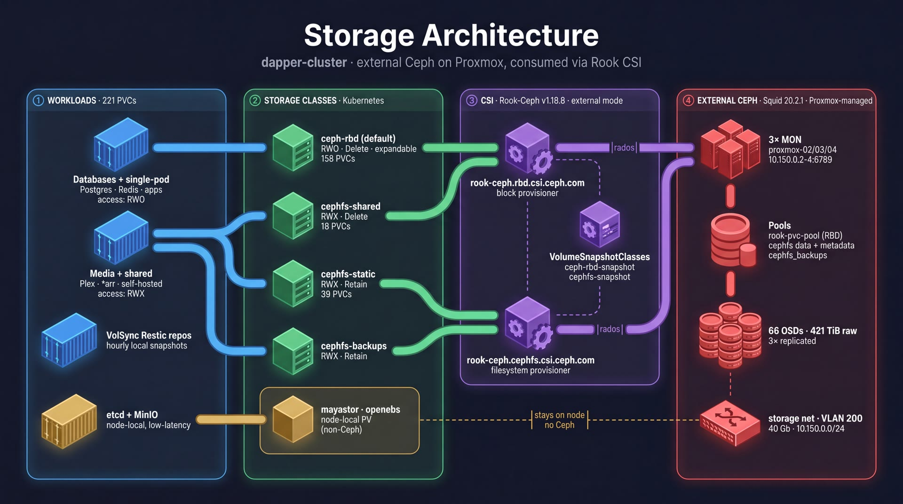
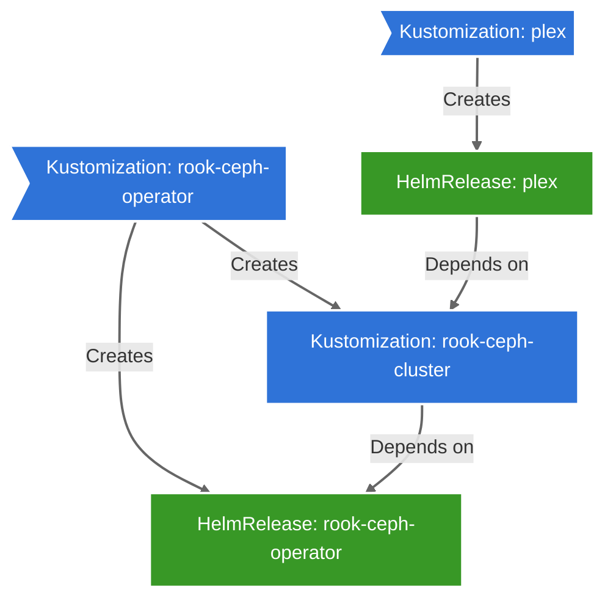
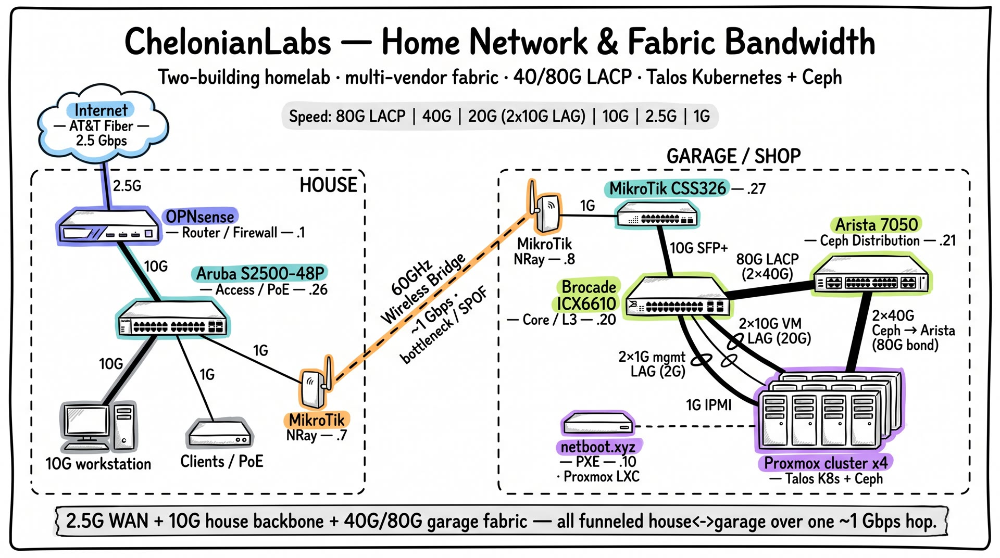
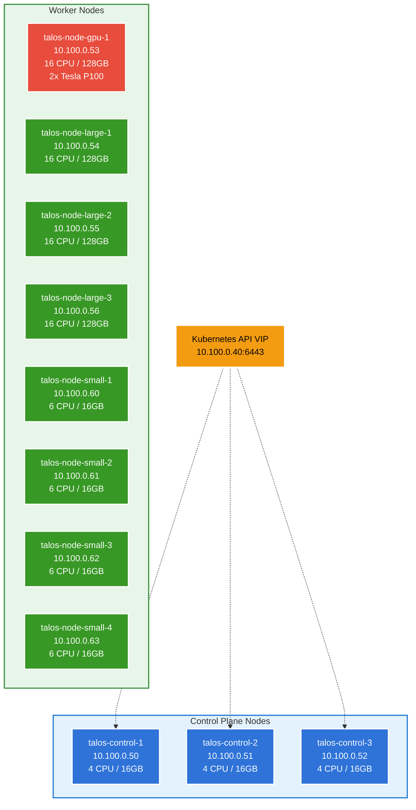
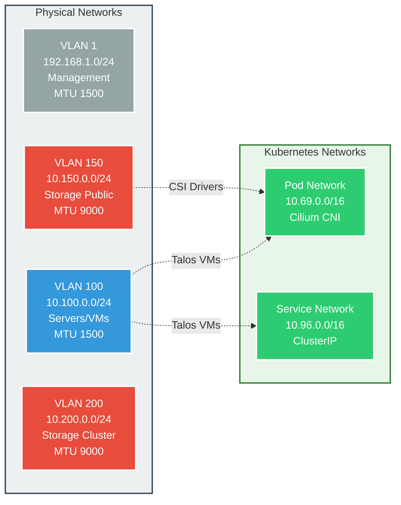

<div align="center">


###  My Home Operations Repository 

_... managed with Flux, Renovate, and GitHub Actions_ 

</div>

<div align="center">

[](https://discord.gg/home-operations)&nbsp;&nbsp;
[](https://talos.dev)&nbsp;&nbsp;
[](https://kubernetes.io)&nbsp;&nbsp;
[](https://fluxcd.io)&nbsp;&nbsp;
[](https://github.com/dapperdivers/dapper-cluster/actions/workflows/renovate.yaml)

</div>

<div align="center">

[](https://status.chelonianlabs.com)&nbsp;&nbsp;
[](https://status.chelonianlabs.com)

</div>

<div align="center">

[](https://github.com/kashalls/kromgo)&nbsp;&nbsp;
[](https://github.com/kashalls/kromgo)&nbsp;&nbsp;
[](https://github.com/kashalls/kromgo)&nbsp;&nbsp;
[](https://github.com/kashalls/kromgo)&nbsp;&nbsp;
[](https://github.com/kashalls/kromgo)&nbsp;&nbsp;
[](https://github.com/kashalls/kromgo)&nbsp;&nbsp;
[](https://github.com/kashalls/kromgo)&nbsp;&nbsp;
[](https://github.com/kashalls/kromgo)

</div>

---

##  Overview

This is a mono repository for my home infrastructure and Kubernetes cluster. I try to adhere to Infrastructure as Code (IaC) and GitOps practices using tools like [Kubernetes](https://kubernetes.io/), [Talos Linux](https://www.talos.dev/), [Flux](https://github.com/fluxcd/flux2), [Renovate](https://github.com/renovatebot/renovate), and [GitHub Actions](https://github.com/features/actions).

---

##  Kubernetes

My Kubernetes cluster is deployed with [Talos](https://www.talos.dev). All persistent storage is provided by an external [Ceph](https://ceph.io/) cluster running on the Proxmox hosts, connected to Kubernetes via [Rook](https://rook.io/) in external-cluster mode.

**Storage Architecture:**

- **Block (RBD)**: `ceph-rbd` (default StorageClass) for databases and single-pod workloads (RWO)
- **Shared filesystem (CephFS)**: `cephfs-shared` / `cephfs-static` / `cephfs-backups` for multi-pod and media workloads (RWX)
- **Backups**: [VolSync](https://github.com/backube/volsync) (Restic) snapshots of every stateful PVC
- **Ceph cluster**: Ceph 18.2.x (Reef) on Proxmox, dedicated 40Gb storage network (VLAN 200)

<div align="center">
  
</div>

There is a template over at [onedr0p/cluster-template](https://github.com/onedr0p/cluster-template) if you want to try and follow along with some of the practices used here.

### Core Components

**Networking:**

- [cilium](https://github.com/cilium/cilium): eBPF-based CNI with kube-proxy replacement, L2 announcements, and LB-IPAM.
- [multus-cni](https://github.com/k8snetworkplumbingwg/multus-cni): Multiple network interfaces per pod for IoT and legacy network integration.
- [envoy-gateway](https://gateway.envoyproxy.io/): Gateway API implementation; internal, external, and media Gateways route traffic via HTTPRoutes.
- [external-dns](https://github.com/kubernetes-sigs/external-dns): Syncs public DNS records to Cloudflare.
- [k8s-gateway](https://github.com/ori-edge/k8s_gateway): Authoritative internal DNS for cluster hostnames.
- [cloudflared](https://github.com/cloudflare/cloudflared): Secure Cloudflare tunnels for external access.

**Storage:**

- [rook-ceph](https://rook.io/): Connects Kubernetes to the external Proxmox Ceph cluster and provides the RBD + CephFS CSI drivers.
- [volsync](https://github.com/backube/volsync): PVC backup and recovery (Restic).

**Security & Secrets:**

- [cert-manager](https://github.com/cert-manager/cert-manager): Automated SSL/TLS certificate management.
- [external-secrets](https://github.com/external-secrets/external-secrets): Secrets management using [Infisical](https://infisical.com/).
- [sops](https://github.com/getsops/sops): Encrypted secrets in Git.

**Observability:**

- [kube-prometheus-stack](https://github.com/prometheus-operator/kube-prometheus-stack): Prometheus, Grafana, and Alertmanager.
- [victoria-logs](https://github.com/VictoriaMetrics/VictoriaLogs): Log aggregation and query.
- [fluent-bit](https://github.com/fluent/fluent-bit): Log shipper into VictoriaLogs.
- [gatus](https://github.com/TwiN/gatus): Service health monitoring and status page.
- [ntfy](https://ntfy.sh/): Self-hosted push notifications for Gatus and Alertmanager alerts.
- [network-ups-tools](https://networkupstools.org/): UPS power monitoring (NUT), surfaced via PeaNUT and a Prometheus exporter.

**GPU & Hardware:**

- [nvidia-device-plugin](https://github.com/NVIDIA/k8s-device-plugin): GPU support for 2x Tesla P100 GPUs (time-sliced ×4 → 8 schedulable units).
- [intel-device-plugin](https://github.com/intel/intel-device-plugins-for-kubernetes): Intel hardware acceleration.
- [node-feature-discovery](https://github.com/kubernetes-sigs/node-feature-discovery): Automatic hardware capability detection.

**GitOps & Automation:**

- [actions-runner-controller](https://github.com/actions/actions-runner-controller): Self-hosted GitHub runners.
- [spegel](https://github.com/spegel-org/spegel): Stateless cluster-local OCI registry mirror.
- [system-upgrade-controller](https://github.com/rancher/system-upgrade-controller): Automated Talos system upgrades.

### GitOps

[Flux](https://github.com/fluxcd/flux2) watches the clusters in my [kubernetes](./kubernetes/) folder (see Directories below) and makes the changes to my clusters based on the state of my Git repository.

The way Flux works for me here is it will recursively search the `kubernetes/apps` folder until it finds the most top level `kustomization.yaml` per directory and then apply all the resources listed in it. That aforementioned `kustomization.yaml` will generally only have a namespace resource and one or many Flux kustomizations (`ks.yaml`). Under the control of those Flux kustomizations there will be a `HelmRelease` or other resources related to the application which will be applied.

[Renovate](https://github.com/renovatebot/renovate) watches my **entire** repository looking for dependency updates, when they are found a PR is automatically created. When some PRs are merged Flux applies the changes to my cluster.

### Directories

This Git repository contains the following directories under [Kubernetes](./kubernetes/).

```sh
📁 kubernetes
├── 📁 apps           # applications
├── 📁 bootstrap      # bootstrap procedures
└── 📁 flux           # flux system config + reusable components
```

### Flux Workflow

This is a high-level look how Flux deploys my applications with dependencies. In most cases a `HelmRelease` will depend on other `HelmRelease`'s, in other cases a `Kustomization` will depend on other `Kustomization`'s, and in rare situations an app can depend on a `HelmRelease` and a `Kustomization`. The example below shows that `plex` won't be deployed or upgrade until the storage dependencies are installed and in a healthy state.


```mermaid
graph TD
    %% Styling
    classDef kustomization fill:#2f73d8,stroke:#fff,stroke-width:2px,color:#fff
    classDef helmRelease fill:#389826,stroke:#fff,stroke-width:2px,color:#fff

    %% Nodes
    A>Kustomization: rook-ceph-operator]:::kustomization
    B[HelmRelease: rook-ceph-operator]:::helmRelease
    C[Kustomization: rook-ceph-cluster]:::kustomization
    D>Kustomization: plex]:::kustomization
    E[HelmRelease: plex]:::helmRelease

    %% Relationships with styled edges
    A -->|Creates| B
    A -->|Creates| C
    C -->|Depends on| B
    D -->|Creates| E
    E -->|Depends on| C

    %% Link styling
    linkStyle default stroke:#666,stroke-width:2px
```

### Networking

My network spans two physical locations connected via a 60GHz wireless bridge, featuring a multi-tier switching architecture optimized for high-performance storage and compute workloads.

<div align="center">
  
</div>

**Key Features:**

- Dual locations connected via 60GHz wireless (1Gbps)
- Multi-tier switching: Core (Brocade), Distribution (Arista), Access (Aruba)
- Dedicated 40Gb storage network on Arista
- LACP bonding on server links for redundancy

<details>
  <summary>Kubernetes Cluster</summary>


```mermaid
graph TB
    %% Styling
    classDef control fill:#2f73d8,stroke:#fff,stroke-width:2px,color:#fff
    classDef worker fill:#389826,stroke:#fff,stroke-width:2px,color:#fff
    classDef gpu fill:#e74c3c,stroke:#fff,stroke-width:2px,color:#fff
    classDef vip fill:#f39c12,stroke:#fff,stroke-width:3px,color:#000

    VIP["Kubernetes API VIP<br/>10.100.0.40:6443"]:::vip

    subgraph ControlPlane["Control Plane Nodes"]
        CP1["talos-control-1<br/>10.100.0.50<br/>4 CPU / 16GB"]:::control
        CP2["talos-control-2<br/>10.100.0.51<br/>4 CPU / 16GB"]:::control
        CP3["talos-control-3<br/>10.100.0.52<br/>4 CPU / 16GB"]:::control
    end

    subgraph Workers["Worker Nodes"]
        GPU["talos-node-gpu-1<br/>10.100.0.53<br/>16 CPU / 128GB<br/>2x Tesla P100"]:::gpu
        W1["talos-node-large-1<br/>10.100.0.54<br/>16 CPU / 128GB"]:::worker
        W2["talos-node-large-2<br/>10.100.0.55<br/>16 CPU / 128GB"]:::worker
        W3["talos-node-large-3<br/>10.100.0.56<br/>16 CPU / 128GB"]:::worker
        S1["talos-node-small-1<br/>10.100.0.60<br/>6 CPU / 16GB"]:::worker
        S2["talos-node-small-2<br/>10.100.0.61<br/>6 CPU / 16GB"]:::worker
        S3["talos-node-small-3<br/>10.100.0.62<br/>6 CPU / 16GB"]:::worker
        S4["talos-node-small-4<br/>10.100.0.63<br/>6 CPU / 16GB"]:::worker
    end

    VIP -.-> CP1
    VIP -.-> CP2
    VIP -.-> CP3

    style ControlPlane fill:#e3f2fd,stroke:#1976d2,stroke-width:2px
    style Workers fill:#e8f5e9,stroke:#388e3c,stroke-width:2px
```

**Cluster Configuration:**

- **Total Nodes:** 11 (3 control plane, 8 workers)
- **Workers:** 1x GPU (2x Tesla P100), 3x large (16 CPU / 128GB), 4x small (6 CPU / 16GB)
- **OS:** Talos Linux (Kubernetes v1.36)
- **CNI:** Cilium with eBPF (10.69.0.0/16 pod CIDR)
- **API VIP:** 10.100.0.40 (shared across control plane)

</details>

<details>
  <summary>VLAN & Network Segmentation</summary>


```mermaid
graph LR
    %% Styling
    classDef mgmt fill:#95a5a6,stroke:#fff,stroke-width:2px,color:#fff
    classDef servers fill:#3498db,stroke:#fff,stroke-width:2px,color:#fff
    classDef storage fill:#e74c3c,stroke:#fff,stroke-width:2px,color:#fff
    classDef k8s fill:#2ecc71,stroke:#fff,stroke-width:2px,color:#fff

    subgraph Physical["Physical Networks"]
        V1["VLAN 1<br/>192.168.1.0/24<br/>Management<br/>MTU 1500"]:::mgmt
        V100["VLAN 100<br/>10.100.0.0/24<br/>Servers/VMs<br/>MTU 1500"]:::servers
        V150["VLAN 150<br/>10.150.0.0/24<br/>Storage Public<br/>MTU 9000"]:::storage
        V200["VLAN 200<br/>10.200.0.0/24<br/>Storage Cluster<br/>MTU 9000"]:::storage
    end

    subgraph Kubernetes["Kubernetes Networks"]
        POD["Pod Network<br/>10.69.0.0/16<br/>Cilium CNI"]:::k8s
        SVC["Service Network<br/>10.96.0.0/16<br/>ClusterIP"]:::k8s
    end

    V100 -.Talos VMs.-> POD
    V100 -.Talos VMs.-> SVC
    V150 -.CSI Drivers.-> POD

    style Physical fill:#ecf0f1,stroke:#34495e,stroke-width:2px
    style Kubernetes fill:#e8f5e9,stroke:#2e7d32,stroke-width:2px
```

**Network Details:**

- **VLAN 1:** Switch management, IPMI, gateway: OPNsense
- **VLAN 100:** Kubernetes nodes, gateway: OPNsense, internet access
- **VLAN 150:** Storage client connections, jumbo frames, L2 only
- **VLAN 200:** Storage cluster traffic (40Gb dedicated), jumbo frames, L2 only
- **Pod Network:** Cilium eBPF-based CNI with native routing
- **Service Network:** Standard Kubernetes ClusterIP services

</details>

For detailed network documentation including switch configurations, see [Network Architecture](./docs/src/architecture/network-topology.md).

---

##  Cloud Dependencies

While most of my infrastructure and workloads are self-hosted I do rely upon the cloud for certain key parts of my setup. This saves me from having to worry about three things. (1) Dealing with chicken/egg scenarios, (2) services I critically need whether my cluster is online or not and (3) The "hit by a bus factor" - what happens to critical apps (e.g. Email, Password Manager, Photos) that my family relies on when I no longer around.

Alternative solutions to the first two of these problems would be to host a Kubernetes cluster in the cloud and deploy applications like [HCVault](https://www.vaultproject.io/), [Vaultwarden](https://github.com/dani-garcia/vaultwarden), [ntfy](https://ntfy.sh/), and [Gatus](https://gatus.io/); however, maintaining another cluster and monitoring another group of workloads would be more work and probably be more or equal out to the same costs as described below.

| Service                                     | Use                                                            | Cost          |
| ------------------------------------------- | -------------------------------------------------------------- | ------------- |
| [Infisical](https://infisical.com/)         | Secrets with [External Secrets](https://external-secrets.io/)  | Free          |
| [Cloudflare](https://www.cloudflare.com/)   | Domain and S3                                                  | Free          |
| [GCP](https://cloud.google.com/)            | Voice interactions with Home Assistant over Google Assistant   | Free          |
| [GitHub](https://github.com/)               | Hosting this repository and continuous integration/deployments | Free          |
| [Migadu](https://migadu.com/)               | Email hosting                                                  | ~$20/yr       |
| [Pushover](https://pushover.net/)           | Kubernetes Alerts and application notifications                | $5 OTP        |
| [Healthchecks.io](https://healthchecks.io/) | Dead-man's-switch for the Alertmanager heartbeat               | Free          |
|                                             |                                                                | Total: ~$2/mo |

---

##  DNS

Internal name resolution is handled by [k8s-gateway](https://github.com/ori-edge/k8s_gateway), which is authoritative for my private domains and answers with the internal Envoy Gateway's load-balancer IP. My OPNsense resolver forwards those domains to it. Public records are synced to `Cloudflare` by a single [ExternalDNS](https://github.com/kubernetes-sigs/external-dns) instance, and external traffic reaches the cluster through a [Cloudflare Tunnel](https://github.com/cloudflare/cloudflared). Whether a service is internal- or external-facing is determined by which Gateway its `HTTPRoute` attaches to.

---

##  Hardware

### Compute Infrastructure

| Device         | CPU                                                | RAM   | Storage                                             | Network                                     | Function                                  |
| -------------- | -------------------------------------------------- | ----- | --------------------------------------------------- | ------------------------------------------- | ----------------------------------------- |
| **Proxmox-01** | Intel Xeon E3-1230 V2<br/>(4 cores @ 3.30GHz)      | 16GB  | 24x 4TB HDD                                         | 1Gb IPMI<br/>2x 1Gb<br/>2x 10Gb<br/>2x 40Gb | Ceph OSDs                                 |
| **Proxmox-02** | 2x Intel Xeon X5680<br/>(24 cores @ 3.33GHz)       | 196GB | 2x 120GB ZFS mirror                                 | 1Gb IPMI<br/>2x 1Gb<br/>2x 10Gb<br/>2x 40Gb | Kubernetes + Ceph                         |
| **Proxmox-03** | 2x Intel Xeon E5-2697A v4<br/>(64 cores @ 2.60GHz) | 516GB | 1x 3.92TB SSD + 1x 800GB<br/>**2x Tesla P100 16GB** | 1Gb IPMI<br/>2x 1Gb<br/>2x 10Gb<br/>2x 40Gb | Kubernetes + Ceph<br/>**GPU Passthrough** |
| **Proxmox-04** | 2x Intel Xeon X5680<br/>(24 cores @ 3.33GHz)       | 196GB | 8x 10TB + 1x 3.84TB + 1x 800GB                      | 1Gb IPMI<br/>2x 1Gb<br/>2x 10Gb<br/>2x 40Gb | Kubernetes + Ceph                         |

**Total Cluster Resources:**

- **CPU:** 116 cores total
- **RAM:** 924GB total
- **Storage:** 476.96TB raw (76 drives across all hosts + JBOD), pooled into the external Ceph cluster
- **GPU:** 2x NVIDIA Tesla P100 16GB (32GB VRAM total)
- **Network:** Multi-tier switching with 40Gb Ceph network

### Kubernetes VMs (Talos Linux)

| VM Name            | vCPU | RAM   | Host            | Role          | Notes                   |
| ------------------ | ---- | ----- | --------------- | ------------- | ----------------------- |
| talos-control-1    | 4    | 16GB  | Proxmox-03      | Control Plane |                         |
| talos-control-2    | 4    | 16GB  | Proxmox-04      | Control Plane |                         |
| talos-control-3    | 4    | 16GB  | Proxmox-02      | Control Plane |                         |
| talos-node-gpu-1   | 16   | 128GB | Proxmox-03      | Worker        | 2x P100 GPU passthrough |
| talos-node-large-1 | 16   | 128GB | Proxmox-03      | Worker        |                         |
| talos-node-large-2 | 16   | 128GB | Proxmox-03      | Worker        |                         |
| talos-node-large-3 | 16   | 128GB | Proxmox-03      | Worker        |                         |
| talos-node-small-1 | 6    | 16GB  | Proxmox cluster | Worker        |                         |
| talos-node-small-2 | 6    | 16GB  | Proxmox cluster | Worker        |                         |
| talos-node-small-3 | 6    | 16GB  | Proxmox cluster | Worker        |                         |
| talos-node-small-4 | 6    | 16GB  | Proxmox cluster | Worker        |                         |

**Kubernetes Cluster Totals:** 100 vCPU, 624GB RAM, 2x Tesla P100 GPUs

### Network Equipment

| Device              | Model              | Location | Role             | Specs                                         |
| ------------------- | ------------------ | -------- | ---------------- | --------------------------------------------- |
| **OPNsense Router** | Custom (i3-4130T)  | House    | Gateway/Firewall | 2C/4T @ 2.90GHz, 16GB RAM, 2.5Gb ATT Fiber    |
| **Brocade ICX6610** | Enterprise Switch  | Garage   | Core L3 Switch   | 48x 1/10Gb ports, 4x 40Gb QSFP+, VLAN routing |
| **Arista 7050**     | Data Center Switch | Garage   | Distribution     | 48x 10Gb SFP+, 4x 40Gb QSFP+                  |
| **Aruba S2500-48p** | Access Switch      | House    | PoE Access       | 48x 1Gb PoE+ ports                            |
| **Mikrotik NRay60** | 60GHz Radio (x2)   | Both     | Wireless Bridge  | 1Gbps point-to-point link                     |

### Storage

**Storage Distribution (Ceph OSDs across Proxmox hosts):**

- **Proxmox-01:** 24x 4TB HDD (96TB)
- **Proxmox-03:** 3x 4TB + 7x 10TB + 2x 12TB (106TB)
- **Proxmox-04:** 8x 10TB + 1x 3.84TB + 1x 800GB (84.64TB)
- **JBOD Shelf:** 18x 10TB + 1x 3.84TB + 1x 800GB (184.64TB)
- **Total Raw Capacity:** 476.96TB across 76 drives
- **Network:** Dedicated 40Gb network for Ceph traffic (VLAN 200)

---

##  Stargazers

<div align="center">

<a href="https://star-history.com/#dapperdivers/dapper-cluster&Date">
  <picture>
    <source media="(prefers-color-scheme: dark)" srcset="https://api.star-history.com/svg?repos=dapperdivers/dapper-cluster&type=Date&theme=dark" />
    <source media="(prefers-color-scheme: light)" srcset="https://api.star-history.com/svg?repos=dapperdivers/dapper-cluster&type=Date" />
    
  </picture>
</a>

</div>

---

##  Gratitude and Thanks

Thanks to all the people who donate their time to the [Home Operations](https://discord.gg/home-operations) Discord community. Be sure to check out [kubesearch.dev](https://kubesearch.dev/) for ideas on how to deploy applications or get ideas on what you could deploy.
