<div align="center">


###  My Home Operations Repository 

_... managed with Flux, Renovate, and GitHub Actions_ 

</div>

<div align="center">

[](https://discord.gg/home-operations)&nbsp;&nbsp;
[](https://talos.dev)&nbsp;&nbsp;
[](https://kubernetes.io)&nbsp;&nbsp;
[](https://fluxcd.io)&nbsp;&nbsp;
[](https://github.com/dapperdivers/dapper-cluster/actions/workflows/renovate.yaml)

</div>

<div align="center">

[](https://status.chelonianlabs.com)&nbsp;&nbsp;
[](https://status.chelonianlabs.com)&nbsp;&nbsp;
[](https://status.chelonianlabs.com)

</div>

<div align="center">

[](https://github.com/kashalls/kromgo)&nbsp;&nbsp;
[](https://github.com/kashalls/kromgo)&nbsp;&nbsp;
[](https://github.com/kashalls/kromgo)&nbsp;&nbsp;
[](https://github.com/kashalls/kromgo)&nbsp;&nbsp;
[](https://github.com/kashalls/kromgo)&nbsp;&nbsp;
[](https://github.com/kashalls/kromgo)&nbsp;&nbsp;
[](https://github.com/kashalls/kromgo)&nbsp;&nbsp;
[](https://github.com/kashalls/kromgo)

</div>

---

##  Overview

This is a mono repository for my home infrastructure and Kubernetes cluster. I try to adhere to Infrastructure as Code (IaC) and GitOps practices using tools like [Ansible](https://www.ansible.com/), [Terraform](https://www.terraform.io/), [Kubernetes](https://kubernetes.io/), [Flux](https://github.com/fluxcd/flux2), [Renovate](https://github.com/renovatebot/renovate), and [GitHub Actions](https://github.com/features/actions).

---

##  Kubernetes

My Kubernetes cluster is deployed with [Talos](https://www.talos.dev). Storage is provided by Rook Ceph, connecting to an external Ceph cluster running on Proxmox hosts.

**Storage Architecture:**
- **CephFS**: Shared filesystem access for multi-node workloads (RWX)
- **RBD**: High-performance block storage for databases and stateful applications (RWO)
- **Network**: Dedicated 40Gb network for Ceph cluster traffic (VLAN 200)
- **Public Network**: 2x10Gb bonded links for client connections (VLAN 150)
- **Migration Status**: Decommissioning legacy Unraid servers in favor of Ceph storage

There is a template over at [onedr0p/cluster-template](https://github.com/onedr0p/cluster-template) if you want to try and follow along with some of the practices used here.

### Core Components

**Networking:**
- [cilium](https://github.com/cilium/cilium): eBPF-based CNI with kube-proxy replacement, L2 announcements, and advanced networking features.
- [multus-cni](https://github.com/k8snetworkplumbingwg/multus-cni): Multiple network interfaces per pod for IoT and legacy network integration.
- [ingress-nginx](https://github.com/kubernetes/ingress-nginx): Dual ingress controllers (internal + external) for service routing.
- [external-dns](https://github.com/kubernetes-sigs/external-dns): Automatic DNS management (internal via UniFi, external via Cloudflare).
- [k8s-gateway](https://github.com/ori-edge/k8s_gateway): Internal DNS server for cluster services.
- [cloudflared](https://github.com/cloudflare/cloudflared): Secure Cloudflare tunnels for external access.

**Storage:**
- [rook-ceph](https://github.com/rook/rook): External Ceph cluster integration with CephFS and RBD storage classes.
- [democratic-csi](https://github.com/democratic-csi/democratic-csi): NFS storage provisioner.
- [volsync](https://github.com/backube/volsync): PVC backup and recovery using CephFS backend.

**Security & Secrets:**
- [cert-manager](https://github.com/cert-manager/cert-manager): Automated SSL/TLS certificate management.
- [external-secrets](https://github.com/external-secrets/external-secrets): Secrets management using [Infisical](https://infisical.com/).
- [sops](https://github.com/getsops/sops): Encrypted secrets in Git.

**Observability:**
- [kube-prometheus-stack](https://github.com/prometheus-operator/kube-prometheus-stack): Prometheus, Grafana, and Alertmanager.
- [loki](https://github.com/grafana/loki): Log aggregation and query.
- [promtail](https://github.com/grafana/promtail): Log shipper for Loki.
- [gatus](https://github.com/TwiN/gatus): Service health monitoring and status page.

**GPU & Hardware:**
- [nvidia-device-plugin](https://github.com/NVIDIA/k8s-device-plugin): GPU support for 4x Tesla P100 GPUs.
- [intel-device-plugin](https://github.com/intel/intel-device-plugins-for-kubernetes): Intel hardware acceleration.
- [node-feature-discovery](https://github.com/kubernetes-sigs/node-feature-discovery): Automatic hardware capability detection.

**GitOps & Automation:**
- [actions-runner-controller](https://github.com/actions/actions-runner-controller): Self-hosted GitHub runners.
- [spegel](https://github.com/spegel-org/spegel): Stateless cluster-local OCI registry mirror.
- [system-upgrade-controller](https://github.com/rancher/system-upgrade-controller): Automated Talos system upgrades.

### GitOps

[Flux](https://github.com/fluxcd/flux2) watches the clusters in my [kubernetes](./kubernetes/) folder (see Directories below) and makes the changes to my clusters based on the state of my Git repository.

The way Flux works for me here is it will recursively search the `kubernetes/apps` folder until it finds the most top level `kustomization.yaml` per directory and then apply all the resources listed in it. That aforementioned `kustomization.yaml` will generally only have a namespace resource and one or many Flux kustomizations (`ks.yaml`). Under the control of those Flux kustomizations there will be a `HelmRelease` or other resources related to the application which will be applied.

[Renovate](https://github.com/renovatebot/renovate) watches my **entire** repository looking for dependency updates, when they are found a PR is automatically created. When some PRs are merged Flux applies the changes to my cluster.

### Directories

This Git repository contains the following directories under [Kubernetes](./kubernetes/).

```sh
📁 kubernetes
├── 📁 apps           # applications
├── 📁 bootstrap      # bootstrap procedures
├── 📁 components     # re-useable components
└── 📁 flux           # flux system configuration
```

### Flux Workflow

This is a high-level look how Flux deploys my applications with dependencies. In most cases a `HelmRelease` will depend on other `HelmRelease`'s, in other cases a `Kustomization` will depend on other `Kustomization`'s, and in rare situations an app can depend on a `HelmRelease` and a `Kustomization`. The example below shows that `plex` won't be deployed or upgrade until the `rook-ceph-cluster` is installed and in a healthy state.


### Networking

```mermaid
graph TB
    %% Styling
    classDef router fill:#d83933,stroke:#fff,stroke-width:2px,color:#fff
    classDef coreswitch fill:#2f73d8,stroke:#fff,stroke-width:2px,color:#fff
    classDef distswitch fill:#389826,stroke:#fff,stroke-width:2px,color:#fff
    classDef accessswitch fill:#f39c12,stroke:#fff,stroke-width:2px,color:#fff
    classDef server fill:#8e44ad,stroke:#fff,stroke-width:2px,color:#fff
    classDef vm fill:#16a085,stroke:#fff,stroke-width:2px,color:#fff
    classDef wireless fill:#e74c3c,stroke:#fff,stroke-width:2px,color:#fff

    subgraph House["🏠 House Location"]
        OPN["OPNsense Router<br/>192.168.1.1<br/>Gateway: VLAN 1, 100"]:::router
        ARUBA["Aruba S2500-48p<br/>Access Switch<br/>192.168.1.26"]:::accessswitch
        CLIENTS["Client Devices<br/>Workstations, IoT"]
        WHOUSE["Mikrotik 60GHz Radio<br/>192.168.1.7<br/>1Gbps Bridge"]:::wireless

        OPN --- ARUBA
        ARUBA --- CLIENTS
        ARUBA --- WHOUSE
    end

    subgraph Bridge["⚡ 60GHz Wireless Bridge"]
        WHOUSE -.1Gbps Wireless Link.-> WSHOP
    end

    subgraph Garage["🏭 Garage/Shop (Server Room)"]
        WSHOP["Mikrotik 60GHz Radio<br/>192.168.1.8<br/>1Gbps Bridge"]:::wireless
        BROCADE["Brocade ICX6610<br/>Core L3 Switch<br/>192.168.1.20<br/>Routes: VLAN 150/200"]:::coreswitch
        ARISTA["Arista 7050<br/>Distribution Switch<br/>192.168.1.21<br/>40Gb Storage Network"]:::distswitch

        WSHOP --- BROCADE
        BROCADE <-->|2x 40Gb QSFP+<br/>LAG| ARISTA

        subgraph Compute["Compute Infrastructure"]
            PX1["Proxmox-01<br/>192.168.1.62<br/>64C/512GB"]:::server
            PX2["Proxmox-02<br/>192.168.1.63<br/>64C/512GB"]:::server
            PX3["Proxmox-03<br/>192.168.1.64<br/>64C/512GB"]:::server
            PX4["Proxmox-04<br/>192.168.1.66<br/>64C/512GB"]:::server
        end

        PX1 -->|3x 1Gb + 2x 10Gb| BROCADE
        PX2 -->|3x 1Gb + 2x 10Gb| BROCADE
        PX3 -->|3x 1Gb + 2x 10Gb| BROCADE
        PX4 -->|3x 1Gb + 2x 10Gb| BROCADE

        PX1 -.40Gb Ceph.-> ARISTA
        PX2 -.40Gb Ceph.-> ARISTA
        PX3 -.40Gb Ceph.-> ARISTA
        PX4 -.40Gb Ceph.-> ARISTA
    end

    subgraph K8S["☸️ Kubernetes Cluster (Talos VMs on VLAN 100)"]
        direction LR
        CP1["Control-1<br/>10.100.0.50"]:::vm
        CP2["Control-2<br/>10.100.0.51"]:::vm
        CP3["Control-3<br/>10.100.0.52"]:::vm
        GPU["GPU Node<br/>10.100.0.53<br/>4x P100"]:::vm
        W1["Worker-1<br/>10.100.0.54"]:::vm
        W2["Worker-2<br/>10.100.0.55"]:::vm
        W3["Worker-3<br/>10.100.0.56"]:::vm
    end

    subgraph VLANs["📡 VLANs & Networks"]
        direction TB
        V1["VLAN 1: Management<br/>192.168.1.0/24"]
        V100["VLAN 100: Servers<br/>10.100.0.0/24<br/>Kubernetes VMs"]
        V150["VLAN 150: Ceph Public<br/>10.150.0.0/24<br/>Client I/O - MTU 9000"]
        V200["VLAN 200: Ceph Cluster<br/>10.200.0.0/24<br/>OSD Replication - MTU 9000"]
        CPOD["Pod Network (Cilium)<br/>10.69.0.0/16"]
        CSVC["Service Network<br/>10.96.0.0/16"]
    end

    Compute -.Hosts VMs.-> K8S

    %% Subgraph styling
    style House fill:#ecf0f1,stroke:#34495e,stroke-width:3px
    style Garage fill:#ecf0f1,stroke:#34495e,stroke-width:3px
    style K8S fill:#e8f5e9,stroke:#2e7d32,stroke-width:3px
    style VLANs fill:#fff3e0,stroke:#e65100,stroke-width:3px
    style Compute fill:#f3e5f5,stroke:#6a1b9a,stroke-width:2px
    style Bridge fill:#ffebee,stroke:#c62828,stroke-width:2px

    %% Link styling
    linkStyle default stroke:#666,stroke-width:2px
```

<details>
  <summary>Click here to see my high-level network diagram</summary>



**Network Highlights:**
- **Dual Physical Locations**: House and garage connected via 60GHz wireless bridge (1Gbps)
- **Core Switching**: Brocade ICX6610 provides L3 routing for Ceph networks (VLAN 150/200)
- **High-Speed Storage**: Arista 7050 with 40Gb links per host for dedicated Ceph traffic
- **Kubernetes**: 7 Talos VMs (3 control plane, 4 workers) on VLAN 100
- **Ceph Networks**: Separate public (client) and cluster (replication) networks with jumbo frames
- **CNI**: Cilium with eBPF for pod networking (10.69.0.0/16)

For detailed network topology, see [Network Architecture Documentation](./docs/src/architecture/network-topology.md).

</details>

---

##  Cloud Dependencies

While most of my infrastructure and workloads are self-hosted I do rely upon the cloud for certain key parts of my setup. This saves me from having to worry about three things. (1) Dealing with chicken/egg scenarios, (2) services I critically need whether my cluster is online or not and (3) The "hit by a bus factor" - what happens to critical apps (e.g. Email, Password Manager, Photos) that my family relies on when I no longer around.

Alternative solutions to the first two of these problems would be to host a Kubernetes cluster in the cloud and deploy applications like [HCVault](https://www.vaultproject.io/), [Vaultwarden](https://github.com/dani-garcia/vaultwarden), [ntfy](https://ntfy.sh/), and [Gatus](https://gatus.io/); however, maintaining another cluster and monitoring another group of workloads would be more work and probably be more or equal out to the same costs as described below.

| Service                                         | Use                                                               | Cost           |
|-------------------------------------------------|-------------------------------------------------------------------|----------------|
| [Infisical](https://infisical.com/)            | Secrets with [External Secrets](https://external-secrets.io/)     | Free           |
| [Cloudflare](https://www.cloudflare.com/)       | Domain and S3                                                     | Free           |
| [GCP](https://cloud.google.com/)                | Voice interactions with Home Assistant over Google Assistant      | Free           |
| [GitHub](https://github.com/)                   | Hosting this repository and continuous integration/deployments    | Free           |
| [Migadu](https://migadu.com/)                   | Email hosting                                                     | ~$20/yr        |
| [Pushover](https://pushover.net/)               | Kubernetes Alerts and application notifications                   | $5 OTP         |
| [UptimeRobot](https://uptimerobot.com/)         | Monitoring internet connectivity and external facing applications | Free           |
|                                                 |                                                                   | Total: ~$2/mo  |

---

##  DNS

In my cluster there are two instances of [ExternalDNS](https://github.com/kubernetes-sigs/external-dns) running. One for syncing private DNS records to my `UDM Pro Max` using [ExternalDNS webhook provider for UniFi](https://github.com/kashalls/external-dns-unifi-webhook), while another instance syncs public DNS to `Cloudflare`. This setup is managed by creating ingresses with two specific classes: `internal` for private DNS and `external` for public DNS. The `external-dns` instances then syncs the DNS records to their respective platforms accordingly.

---

##  Hardware

| Device                    | CPU                                              | RAM   | Storage                                          | Function            |
|--------------------------|--------------------------------------------------|-------|--------------------------------------------------|---------------------|
| Proxmox Host (Kubernetes)| 2x Intel Xeon E5-2697A v4 (64 cores @ 2.60GHz)  | 512GB | 1TB NVMe (host), 4x 3.84TB SSD (passthrough)    | Kubernetes Cluster  |
| Proxmox Host (NAS)       | 2x Intel Xeon E5-2687W (32 cores @ 3.10GHz)     | 126GB | 2x 120GB SSD (boot), 800GB NVMe, Various HDDs   | NAS + Storage       |
| OPNsense Router          | Intel i3-4130T (2 cores, 4 threads @ 2.90GHz)   | 16GB  | 120GB SSD                                       | Router              |
| Aruba S2500-48p          | -                                                | -     | -                                               | PoE Switch          |

Additional Hardware:
- 4x Tesla P100 16GB GPUs (passthrough to Kubernetes host)
- 7x Virtualized Talos VMs running on Kubernetes host

---

##  Stargazers

<div align="center">

<a href="https://star-history.com/#dapperdivers/dapper-cluster&Date">
  <picture>
    <source media="(prefers-color-scheme: dark)" srcset="https://api.star-history.com/svg?repos=dapperdivers/dapper-cluster&type=Date&theme=dark" />
    <source media="(prefers-color-scheme: light)" srcset="https://api.star-history.com/svg?repos=dapperdivers/dapper-cluster&type=Date" />
    
  </picture>
</a>

</div>

---

##  Gratitude and Thanks

Thanks to all the people who donate their time to the [Home Operations](https://discord.gg/home-operations) Discord community. Be sure to check out [kubesearch.dev](https://kubesearch.dev/) for ideas on how to deploy applications or get ideas on what you could deploy.
