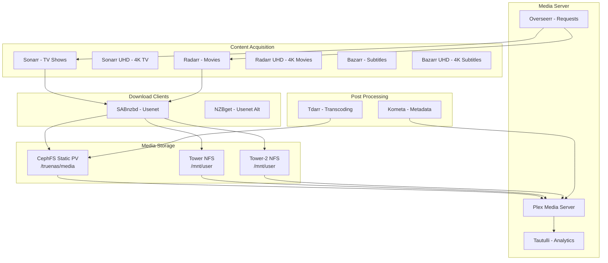

# Media Applications

## Media Stack Overview

The media stack provides automated media management and streaming services using the *arr suite of applications and Plex Media Server.



## Storage Configuration

### Primary Media Library - CephFS

The main media library is stored on CephFS using a static PV that mounts the pre-existing `/truenas/media` directory.

**Configuration**: `kubernetes/apps/media/storage/app/media-cephfs-pv.yaml`

```yaml
apiVersion: v1
kind: PersistentVolume
metadata:
  name: media-cephfs-pv
spec:
  capacity:
    storage: 100Ti
  accessModes:
    - ReadWriteMany
  persistentVolumeReclaimPolicy: Retain
  storageClassName: cephfs-static
  csi:
    driver: rook-ceph.cephfs.csi.ceph.com
    nodeStageSecretRef:
      name: rook-csi-cephfs-static
      namespace: rook-ceph
    volumeAttributes:
      clusterID: rook-ceph
      fsName: cephfs
      staticVolume: "true"
      rootPath: /truenas/media
```

**Mount Pattern**: Applications mount this PVC at `/media` or specific subdirectories:
- `/media/downloads` - Download staging area
- `/media/tv` - TV show library
- `/media/movies` - Movie library
- `/media/music` - Music library
- `/media/books` - Book library

**Benefits**:
- **ReadWriteMany**: Multiple pods can access simultaneously
- **High Performance**: Direct CephFS access, no NFS overhead
- **Shared Access**: All media apps see the same filesystem
- **Snapshots**: VolSync backups protect the data

### Legacy NFS Mounts (Unraid)

Download clients and some media applications use legacy NFS mounts from Unraid servers alongside CephFS.

**Servers**:
- `tower.manor` - Primary Unraid server (100Ti NFS)
- `tower-2.manor` - Secondary Unraid server (100Ti NFS)

**Current Usage**:
- SABnzbd downloads to all three storage backends (CephFS, tower, tower-2)
- Plex reads media from all three storage backends
- Active downloads and in-progress media on Unraid
- Organized/completed media on CephFS

**Status**: Legacy - gradual migration to CephFS in progress

**Configuration**: Static PVs without storage class
```yaml
apiVersion: v1
kind: PersistentVolume
metadata:
  name: media-tower-pv
spec:
  capacity:
    storage: 100Ti
  accessModes:
    - ReadWriteMany
  persistentVolumeReclaimPolicy: Retain
  nfs:
    server: tower.manor
    path: /mnt/user
---
apiVersion: v1
kind: PersistentVolume
metadata:
  name: media-tower-2-pv
spec:
  capacity:
    storage: 100Ti
  accessModes:
    - ReadWriteMany
  persistentVolumeReclaimPolicy: Retain
  nfs:
    server: tower-2.manor
    path: /mnt/user
```

## Core Components

### Media Server

#### Plex Media Server

**Namespace**: `media`
**Purpose**: Media streaming and library management

Plex is the primary media server, providing:
- Streaming to multiple devices
- Hardware transcoding (Intel Quick Sync)
- Library organization and metadata
- User management and sharing
- Remote access

**Configuration**: `kubernetes/apps/media/plex/app/helmrelease.yaml`

**Storage Mounts** (Multi-backend):
- Media library (CephFS): CephFS static PV at `/media`
- Media library (Tower): Tower NFS at `/tower`
- Media library (Tower-2): Tower-2 NFS at `/tower-2`
- Configuration: CephFS dynamic PVC (10Gi)
- Transcoding cache: EmptyDir (temporary)

**Library Configuration**:
- Plex libraries configured to scan all three storage backends
- Unified library view across CephFS and Unraid storage

**Resource Allocation**:
```yaml
resources:
  requests:
    cpu: 2000m
    memory: 4Gi
    gpu.intel.com/i915: 1
  limits:
    cpu: 8000m
    memory: 16Gi
    gpu.intel.com/i915: 1
```

**Hardware Acceleration**: Intel Quick Sync enabled for transcoding

#### Tautulli

**Namespace**: `media`
**Purpose**: Plex analytics and monitoring

Provides:
- Watch history and statistics
- User activity monitoring
- Notification triggers
- API for automation

**Storage**: CephFS dynamic PVC (5Gi) for database and logs

### Content Acquisition (*arr Suite)

#### Sonarr / Sonarr UHD

**Purpose**: TV show automation

- **Sonarr**: Standard quality TV shows
- **Sonarr UHD**: 4K/UHD TV shows

**Features**:
- TV series tracking and monitoring
- Episode search and download
- Quality profiles and upgrades
- Calendar and schedule tracking

**Storage**:
- Configuration: CephFS dynamic PVC (10Gi)
- Media access: CephFS static PV (shared `/media`)

#### Radarr / Radarr UHD

**Purpose**: Movie automation

- **Radarr**: Standard quality movies
- **Radarr UHD**: 4K/UHD movies

**Features**:
- Movie library management
- Automated downloads
- Quality management
- List integration (IMDb, Trakt)

**Storage**:
- Configuration: CephFS dynamic PVC (10Gi)
- Media access: CephFS static PV (shared `/media`)

#### Bazarr / Bazarr UHD

**Purpose**: Subtitle management

Automated subtitle downloading for:
- TV shows (via Sonarr integration)
- Movies (via Radarr integration)
- Multiple languages
- Subtitle providers

**Storage**: CephFS dynamic PVC (5Gi)

### Download Clients

#### SABnzbd

**Namespace**: `media`
**Purpose**: Primary Usenet download client

**Features**:
- NZB file processing
- Automated post-processing
- Category-based handling
- Integration with *arr apps

**Storage Mounts** (Multi-backend):
- Configuration: CephFS dynamic PVC (5Gi)
- Downloads (CephFS): CephFS static PV `/media/downloads/usenet`
- Downloads (Tower): Tower NFS `/tower/downloads/usenet`
- Downloads (Tower-2): Tower-2 NFS `/tower-2/downloads/usenet`
- Incomplete: CephFS dynamic PVC (temporary downloads)

**Download Strategy**:
- Categories route to different storage backends
- Active downloads use appropriate backend based on category
- Completed downloads moved to final library location

**Post-Processing**: Automatically moves completed downloads to appropriate media folders

#### NZBget

**Namespace**: `media`
**Purpose**: Alternative Usenet client

Lightweight alternative to SABnzbd for specific use cases.

**Storage**: Similar pattern to SABnzbd

### Post-Processing

#### Tdarr

**Purpose**: Media transcoding and file optimization

**Components**:
1. **Tdarr Server**: Manages transcoding queue
2. **Tdarr Node**: CPU-based transcoding workers
3. **Tdarr Node GPU**: GPU-accelerated transcoding

**Use Cases**:
- Convert media to h265/HEVC
- Reduce file sizes
- Standardize formats
- Remove unwanted audio/subtitle tracks

**Storage**:
- Configuration: CephFS dynamic PVC (25Gi)
- Media access: CephFS static PV (shared `/media`)
- Transcode cache: CephFS dynamic PVC (100Gi)

**Resource Intensive**: Uses significant CPU/GPU resources during transcoding

#### Kometa (formerly Plex Meta Manager)

**Purpose**: Enhanced Plex metadata and collections

**Features**:
- Automated collections (e.g., "Top Rated 2023")
- Poster and artwork management
- Rating and tag synchronization
- Scheduled metadata updates

**Storage**: CephFS dynamic PVC (5Gi) for configuration

### User Management

#### Overseerr

**Namespace**: `media`
**Purpose**: Media request management

User-facing application for:
- Media requests (movies/TV shows)
- Request approval workflow
- User quotas and limits
- Integration with Sonarr/Radarr

**Authentication**: Integrated with Plex accounts

**Storage**: CephFS dynamic PVC (5Gi)

## Network Configuration

### Internal Access

All media applications are accessible via internal DNS:

```yaml
spec:
  ingressClassName: internal
  hosts:
    - host: plex.chelonianlabs.com
      paths:
        - path: /
          pathType: Prefix
```

### External Access

Plex is accessible externally via:
- Cloudflared tunnel for secure access
- Direct access on port 32400 (firewall controlled)

### Service Discovery

Applications discover each other via Kubernetes services:
- `sonarr.media.svc.cluster.local:8989`
- `radarr.media.svc.cluster.local:7878`
- `sabnzbd.media.svc.cluster.local:8080`
- `plex.media.svc.cluster.local:32400`

## Backup Strategy

### Application Configuration

All *arr application configurations are backed up via VolSync:

**Backup Schedule**: Hourly
**Retention**:
- Hourly: 24 snapshots
- Daily: 7 snapshots
- Weekly: 4 snapshots

**Backup Pattern**:
```yaml
apiVersion: volsync.backube/v1alpha1
kind: ReplicationSource
metadata:
  name: sonarr
  namespace: media
spec:
  sourcePVC: sonarr-config
  trigger:
    schedule: "0 * * * *"
  restic:
    repository: sonarr-restic-secret
    retain:
      hourly: 24
      daily: 7
      weekly: 4
```

### Media Library

**Media files are NOT backed up** via VolSync due to size (100Ti+)

**Protection Strategy**:
- Ceph replication (3x copies across OSDs)
- Replaceable content (can be re-downloaded)
- Critical media manually backed up externally

**Configuration Backup**: All *arr databases and settings are backed up

## Resource Management

### Resource Allocation Strategy

Media applications have varying resource needs:

**High Resource**:
- **Plex**: 2-8 CPU, 4-16Gi RAM, GPU for transcoding
- **Tdarr**: 4-16 CPU, 8-32Gi RAM, GPU optional

**Medium Resource**:
- **Sonarr/Radarr**: 500m-2 CPU, 512Mi-2Gi RAM
- **SABnzbd**: 1-4 CPU, 1-4Gi RAM

**Low Resource**:
- **Bazarr**: 100m-500m CPU, 128Mi-512Mi RAM
- **Overseerr**: 100m-500m CPU, 256Mi-1Gi RAM

### Storage Quotas

Dynamic PVCs sized appropriately:
- Configuration: 5-10Gi (databases, logs)
- Download buffers: 100Gi (temporary downloads)
- Transcode cache: 100Gi (Tdarr working space)

## Maintenance

### Regular Tasks

**Weekly**:
- Review failed downloads
- Check disk space usage
- Verify backup completion
- Update metadata (Kometa)

**Monthly**:
- Library maintenance (Plex)
- Database optimization (*arr apps)
- Review and cleanup old downloads
- Check for application updates (Renovate handles this)

### Health Monitoring

**Key Metrics**:
- Plex stream count and transcoding sessions
- SABnzbd download queue and speed
- *arr indexer health and search failures
- Storage capacity and growth rate

**Alerts**:
- Download failures
- Indexer connectivity issues
- Storage capacity warnings
- Failed backup jobs

## Troubleshooting

### Common Issues

**Plex can't see media files**:
```bash
# Check PVC mount
kubectl exec -n media deployment/plex -- ls -la /media

# Verify permissions
kubectl exec -n media deployment/plex -- ls -ld /media/movies /media/tv

# Check Ceph health
kubectl -n rook-ceph exec -it deploy/rook-ceph-tools -- ceph status
```

**Downloads not moving to library**:
```bash
# Check SABnzbd logs
kubectl logs -n media deployment/sabnzbd --tail=100

# Verify shared storage access
kubectl exec -n media deployment/sabnzbd -- ls -la /media/downloads/usenet

# Check Sonarr/Radarr import
kubectl logs -n media deployment/sonarr --tail=100 | grep -i import
```

**Slow transcoding**:
```bash
# Verify GPU allocation
kubectl describe pod -n media -l app.kubernetes.io/name=plex | grep -A5 "Limits\|Requests"

# Check GPU utilization (on node)
intel_gpu_top

# Review transcode logs
kubectl logs -n media deployment/plex | grep -i transcode
```

**Storage full**:
```bash
# Check PVC usage
kubectl get pvc -n media

# Check storage usage in pod
kubectl exec -n media deployment/plex -- df -h | grep media

# Check Ceph cluster capacity
kubectl -n rook-ceph exec -it deploy/rook-ceph-tools -- ceph df
```

## Best Practices

### Storage Organization

**Directory Structure**:
```
/media/
├── downloads/
│   ├── usenet/          # SABnzbd downloads
│   └── complete/        # Completed downloads
├── movies/              # Radarr managed
│   ├── 4k/             # UHD content
│   └── 1080p/          # HD content
├── tv/                  # Sonarr managed
│   ├── 4k/
│   └── 1080p/
├── music/
└── books/
```

### Quality Profiles

- Use separate instances for 4K content (Sonarr UHD, Radarr UHD)
- Configure appropriate quality cutoffs
- Enable upgrades for better releases
- Set size limits to prevent excessive downloads

### Download Management

- Configure category-based post-processing in SABnzbd
- Use download client categories in *arr apps
- Enable completed download handling
- Set appropriate retention for download history

### Performance Optimization

- Use hardware transcoding (Intel Quick Sync)
- Pre-optimize media with Tdarr (h265/HEVC)
- Adjust Plex transcoder quality settings
- Enable Plex optimize versions for common devices

## Security Considerations

### Access Control

- **Internal Network Only**: Media apps exposed only via internal ingress
- **Authentication Required**: All apps require login
- **Plex Managed Auth**: User access controlled via Plex sharing
- **Overseerr Integration**: Request permissions via Plex accounts

### API Keys

- All API keys stored in Kubernetes secrets
- External Secrets integration with Infisical
- Regular key rotation via automation
- Least privilege access between services

## Future Improvements

### Planned Enhancements

- **GPU Transcoding Pool**: Dedicated GPU nodes for Tdarr
- **Request Automation**: Auto-approve for trusted users
- **Advanced Monitoring**: Grafana dashboards for media metrics
- **Content Analysis**: Automated duplicate detection
- **Unraid Migration**: Gradual migration of tower/tower-2 NFS storage to CephFS
  - Currently using hybrid approach (CephFS + tower + tower-2)
  - Plan: Consolidate all media storage to CephFS
  - Timeline: When Unraid servers are decommissioned

### Under Consideration

- **Jellyfin**: Alternative media server for comparison
- **Prowlarr**: Unified indexer management
- **Readarr**: Book management automation
- **Lidarr**: Music management automation

## References

- **Media Storage**: `kubernetes/apps/media/storage/`
- **Plex**: `kubernetes/apps/media/plex/`
- **Sonarr**: `kubernetes/apps/media/sonarr/`
- **Radarr**: `kubernetes/apps/media/radarr/`
- **SABnzbd**: `kubernetes/apps/media/sabnzbd/`
- **Storage Architecture**: `docs/src/architecture/storage.md`
