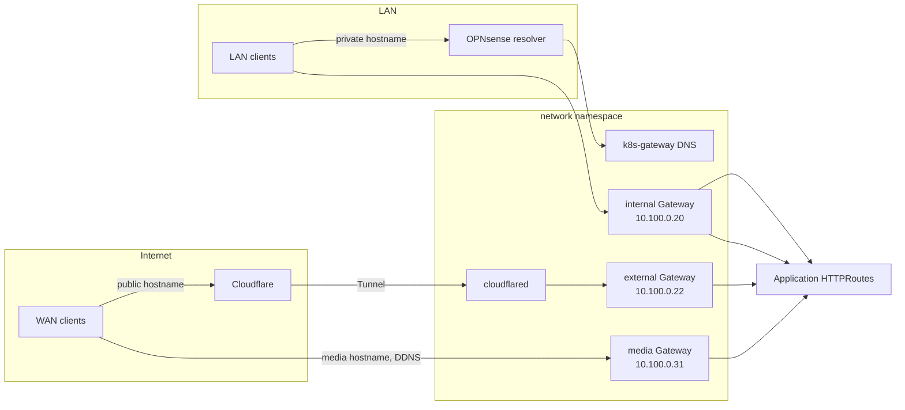

# Network Applications

This document covers the applications running in the `network` namespace: the cluster's ingress, DNS, notification, and CNI plumbing.

All HTTP(S) ingress is handled by **Envoy Gateway** (Gateway API) — there is no Ingress controller. A single `GatewayClass` named `envoy` backs three `Gateway` resources, split by where the traffic comes from and where it is allowed to go:

| Gateway    | LB IP         | Reached via                       | Serves                               |
| ---------- | ------------- | --------------------------------- | ------------------------------------ |
| `internal` | `10.100.0.20` | LAN (private DNS via k8s-gateway) | Private services                     |
| `external` | `10.100.0.22` | Cloudflare Tunnel (cloudflared)   | Public services                      |
| `media`    | `10.100.0.31` | WAN-direct (bypasses the tunnel)  | High-bandwidth media (Plex/Jellyfin) |

Each Gateway gets its VIP from **Cilium LB-IPAM** via an `lbipam.cilium.io/ips` annotation on the Gateway's managed Envoy `LoadBalancer` Service. TLS is terminated with per-domain wildcard certificates issued by cert-manager; the HTTPS listener is auto-selected by request hostname (apps attach with an `HTTPRoute` and omit `sectionName`), and the `:80` listener carries only a global HTTP→HTTPS 301 redirect.

For the underlying DNS design (private domains, OPNsense forwarding, public records), see [Network Architecture](../architecture/network.md).

## Traffic Flow



## Ingress and Gateways

### Envoy Gateway

**Namespace**: `network`
**Type**: Helm Release + Gateway API resources
**Purpose**: Gateway API controller and the cluster's three Gateways

**Configuration**: `kubernetes/apps/network/envoy-gateway/`

- `gateway/gatewayclass.yaml` — the `envoy` GatewayClass, parameterized by a class-wide `EnvoyProxy`.
- `gateway/gateway-internal.yaml` — `internal` Gateway (VIP `10.100.0.20`). Per-domain HTTPS listeners; `:80` restricted to `from: Same` so only the redirect route attaches.
- `gateway/gateway-external.yaml` — `external` Gateway (VIP `10.100.0.22`), labelled `external-dns: "true"`. external-dns derives the public record target from the Gateway and points it at the Cloudflare Tunnel CNAME. Carries both wildcard and apex listeners.
- `gateway/gateway-media.yaml` — `media` Gateway (VIP `10.100.0.31`). Uses a dedicated `EnvoyProxy` running Envoy as a **DaemonSet** with `externalTrafficPolicy: Local` (plus a control-plane toleration) so the real client IP survives to Plex. Reached WAN-direct via an unproxied DDNS record, not the tunnel.
- `gateway/httproutes-redirect.yaml` — global HTTP→HTTPS 301 redirect routes on each Gateway's `:80` listener.

```bash
# Gateways and their assigned VIPs
kubectl -n network get gateways

# Routes attached to a Gateway
kubectl get httproutes -A

# Envoy Gateway controller
kubectl -n network get pods -l app.kubernetes.io/name=gateway-helm
```

### cloudflared

**Namespace**: `network`
**Type**: Helm Release (app-template)
**Purpose**: Cloudflare Tunnel — secure public ingress to the `external` Gateway

**Configuration**: `kubernetes/apps/network/external/cloudflared/`

cloudflared establishes an outbound tunnel to Cloudflare, so no inbound ports are opened on the firewall. Public requests arrive at Cloudflare and are forwarded down the tunnel to the in-cluster Envoy `external` Service. Each ingress rule sets `originServerName` to a hostname matching the correct per-domain HTTPS listener (Envoy selects its listener by TLS SNI; the `Host` header still selects the `HTTPRoute`).

```bash
kubectl -n network logs -l app.kubernetes.io/name=cloudflared -f
```

### external-dns

**Namespace**: `network`
**Type**: Helm Release
**Purpose**: Syncs public DNS records to Cloudflare from Gateway/HTTPRoute resources

**Configuration**: `kubernetes/apps/network/external/external-dns/`

A single external-dns instance watches Gateways labelled `external-dns: "true"` (the `external` and `media` Gateways) and their attached HTTPRoutes, publishing the corresponding records to Cloudflare. The record target is taken from the Gateway annotation — the Cloudflare Tunnel CNAME for `external`, and an unproxied DDNS record for `media`.

### k8s-gateway

**Namespace**: `network`
**Type**: Helm Release
**Purpose**: Authoritative internal DNS for the cluster's private domains

**Configuration**: `kubernetes/apps/network/internal/k8s-gateway/`

k8s-gateway is a CoreDNS-based server that answers for the private `SECRET_DOMAIN*` domains, returning the `internal` Gateway VIP (`10.100.0.20`) for any hostname backed by an HTTPRoute or Service. It runs as a `LoadBalancer` Service (Cilium LB-IPAM VIP) on port 53. The OPNsense resolver forwards those domains to it, so LAN clients resolve cluster hostnames to the internal Gateway. See [Network Architecture](../architecture/network.md) for the resolver chain.

### home-reverse-proxy

**Namespace**: `network`
**Type**: HTTPRoutes + Envoy `Backend` resources
**Purpose**: Give non-cluster LAN hosts cluster hostnames and TLS

**Configuration**: `kubernetes/apps/network/internal/home-reverse-proxy/`

A set of HTTPRoutes (with `ExternalName` Services and Envoy `Backend` resources) that proxy to physical LAN devices such as Proxmox (`circe.manor`) and the OPNsense firewall. This lets those off-cluster services be reached through the `internal` Gateway with a friendly cluster hostname and a valid wildcard certificate, including for self-signed HTTPS upstreams (`insecureSkipVerify`).

## Notifications and Mail

### ntfy

**Namespace**: `network`
**Type**: Helm Release (app-template)
**Purpose**: Self-hosted push-notification server

**Configuration**: `kubernetes/apps/network/ntfy/`

Self-hosted [ntfy](https://ntfy.sh) (`binwiederhier/ntfy`) used as the cluster's notification sink. Both Gatus (uptime) and Alertmanager (via alertmanager-ntfy) publish to it. See [Observability Applications](observability.md) for the alert-routing detail.

### smtp-relay

**Namespace**: `network`
**Type**: Helm Release (app-template)
**Purpose**: Outbound SMTP relay for cluster apps

**Configuration**: `kubernetes/apps/network/smtp-relay/`

A maddy-based SMTP relay providing a single in-cluster mail submission endpoint, so applications that send email use one shared, authenticated upstream rather than each holding provider credentials.

## CNI

### Multus

**Namespace**: `network`
**Type**: Helm Release + NetworkAttachmentDefinition
**Purpose**: Attach additional pod network interfaces beyond the primary Cilium network

**Configuration**: `kubernetes/apps/network/multus/`

Multus is a meta-CNI that lets selected pods receive a second interface in addition to the primary Cilium network. The `multus-iot` `NetworkAttachmentDefinition` uses **macvlan** over a host interface with DHCP IPAM, placing those pods directly on an IoT/legacy L2 segment — used by workloads that must talk to devices outside the cluster's pod network.

```bash
kubectl -n network get net-attach-def
kubectl -n network get pods -l app.kubernetes.io/name=multus
```

## References

- **Envoy Gateway**: `kubernetes/apps/network/envoy-gateway/`
- **cloudflared / external-dns**: `kubernetes/apps/network/external/`
- **k8s-gateway / home-reverse-proxy**: `kubernetes/apps/network/internal/`
- **Network Architecture**: `docs/src/architecture/network.md`
