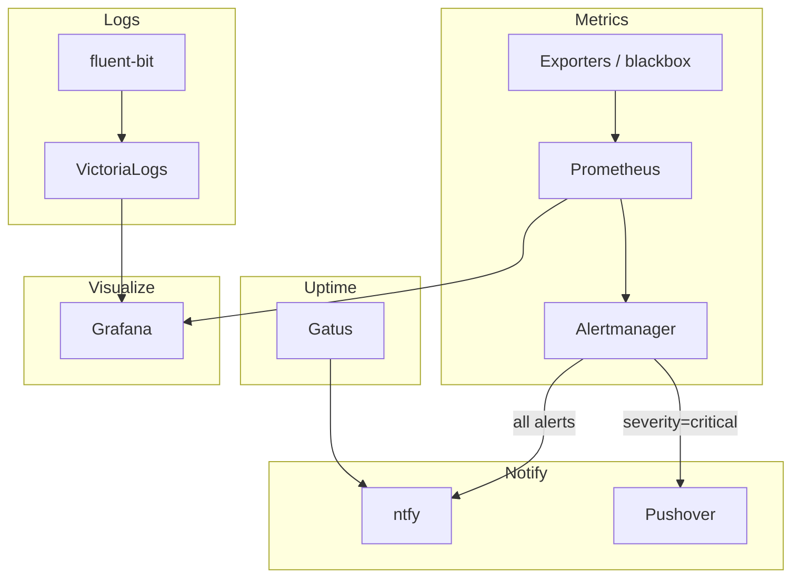

# Observability Applications

This document covers the applications running in the `observability` namespace: metrics, logging, uptime monitoring, alert routing, and resource right-sizing.

Metrics are collected by Prometheus and surfaced in Grafana; container logs are shipped to VictoriaLogs; uptime is tracked by Gatus. Alerts fan out to the self-hosted ntfy server, with critical alerts additionally paged to Pushover.

## Observability Flow



## Metrics and Visualization

### kube-prometheus-stack

**Namespace**: `observability`
**Type**: Helm Release
**Purpose**: Core metrics platform — Prometheus, Alertmanager, node-exporter, kube-state-metrics

**Configuration**: `kubernetes/apps/observability/kube-prometheus-stack/`

The bundle deploys Prometheus (scraping and recording/alerting rules), Alertmanager (alert routing), node-exporter (per-node host metrics), and kube-state-metrics (Kubernetes object state). Additional scrape targets and Alertmanager routing live alongside the HelmRelease in `scrapeconfig.yaml` and `alertmanagerconfig.yaml`.

Alertmanager routing: the default receiver is **ntfy**; `severity=critical` alerts route to **Pushover** (a loud phone push) and continue through to ntfy as well, so criticals are still delivered if Pushover is rate-limited.

```bash
kubectl -n observability get prometheus,alertmanager
kubectl -n observability get pods -l app.kubernetes.io/name=prometheus
```

### Grafana

**Namespace**: `observability`
**Type**: Helm Release
**Purpose**: Visualization layer for metrics and logs

**Configuration**: `kubernetes/apps/observability/grafana/`

Grafana is the dashboard front-end. Its provisioned datasources are **Prometheus** (`prometheus-operated`), **VictoriaLogs** (`victoria-logs-server`), and **Alertmanager**. Dashboards are provisioned declaratively, including via ConfigMaps discovered by the Grafana sidecar.

```bash
kubectl -n observability get pods -l app.kubernetes.io/name=grafana
```

## Logging

### VictoriaLogs

**Namespace**: `observability`
**Type**: Helm Release
**Purpose**: Log storage and query backend

**Configuration**: `kubernetes/apps/observability/victoria-logs/`

VictoriaLogs is the cluster's log store, exposed at `victoria-logs-server.observability.svc.cluster.local:9428` and queried from Grafana via the VictoriaLogs datasource.

### fluent-bit

**Namespace**: `observability`
**Type**: Helm Release (DaemonSet)
**Purpose**: Ships container logs into VictoriaLogs

**Configuration**: `kubernetes/apps/observability/fluent-bit/`

fluent-bit runs on every node, tails container logs, enriches them with Kubernetes metadata, and forwards them over HTTP to the VictoriaLogs server.

```bash
kubectl -n observability get pods -l app.kubernetes.io/name=fluent-bit
```

## Uptime and Probing

### Gatus

**Namespace**: `observability`
**Type**: Helm Release (gatus-sidecar)
**Purpose**: Uptime / status page

**Configuration**: `kubernetes/apps/observability/gatus/`

Gatus uses the **gatus-sidecar** model: endpoints are discovered automatically from `HTTPRoute` resources, with base probe configuration inherited from annotations on the parent Gateway (internal routes become DNS-only "guarded" checks; external/media routes become real HTTP 200 probes resolved via public DNS). Gatus alerts are delivered to **ntfy**. See the gatus-monitoring concept for how to add or tune a check.

```bash
kubectl -n observability get pods -l app.kubernetes.io/name=gatus
```

### blackbox-exporter

**Namespace**: `observability`
**Type**: Helm Release
**Purpose**: Black-box probing of endpoints

**Configuration**: `kubernetes/apps/observability/blackbox-exporter/`

blackbox-exporter performs synthetic probes (HTTP, TCP, ICMP) against targets defined in `probes.yaml`, exposing the results to Prometheus.

### Exporters

**Namespace**: `observability`
**Type**: Helm Releases / DaemonSets
**Purpose**: Assorted Prometheus exporters

**Configuration**: `kubernetes/apps/observability/exporters/`

Additional exporters feeding Prometheus:

- **dcgm-exporter** — NVIDIA GPU metrics.
- **nut-exporter** — UPS metrics from NUT.
- **snmp-exporter** — SNMP metrics from network devices.

## Alerting

### alertmanager-ntfy

**Namespace**: `observability`
**Type**: Helm Release
**Purpose**: Bridges Alertmanager notifications to the self-hosted ntfy server

**Configuration**: `kubernetes/apps/observability/alertmanager-ntfy/`

alertmanager-ntfy receives Alertmanager webhook notifications and republishes them as ntfy messages, so Prometheus alerts land on the self-hosted ntfy server alongside Gatus uptime notifications.

### silence-operator

**Namespace**: `observability`
**Type**: Helm Release + Silence CRs
**Purpose**: Declarative, GitOps-managed Alertmanager silences

**Configuration**: `kubernetes/apps/observability/silence-operator/`

The silence-operator reconciles `Silence` custom resources (`silences/silences.yaml`) into Alertmanager, so silences are version-controlled in Git rather than clicked into the UI.

## Resource Right-Sizing

### VPA and Goldilocks

**Namespace**: `observability`
**Type**: Helm Releases
**Purpose**: Vertical Pod Autoscaler with the Goldilocks recommendation dashboard

**Configuration**: `kubernetes/apps/observability/vpa/`, `kubernetes/apps/observability/goldilocks/`

The Vertical Pod Autoscaler computes recommended CPU/memory requests for workloads; Goldilocks presents those recommendations in a dashboard to guide right-sizing of resource requests.

```bash
kubectl -n observability get vpa -A
```

## Status Reporting

### kromgo

**Namespace**: `observability`
**Type**: Helm Release
**Purpose**: Exposes selected cluster metrics as safe public endpoints

**Configuration**: `kubernetes/apps/observability/kromgo/`

kromgo serves a curated allow-list of Prometheus queries as public, shareable endpoints — used to power the status badges in the repository README without exposing Prometheus itself.

### peanut

**Namespace**: `observability`
**Type**: Helm Release
**Purpose**: NUT (UPS) monitoring dashboard

**Configuration**: `kubernetes/apps/observability/peanut/`

peanut provides a web dashboard for the UPS hardware monitored via NUT (battery charge, load, runtime), complementing the Prometheus nut-exporter metrics.

## References

- **kube-prometheus-stack**: `kubernetes/apps/observability/kube-prometheus-stack/`
- **Grafana**: `kubernetes/apps/observability/grafana/`
- **VictoriaLogs / fluent-bit**: `kubernetes/apps/observability/victoria-logs/`, `kubernetes/apps/observability/fluent-bit/`
- **Gatus**: `kubernetes/apps/observability/gatus/`
- **ntfy (notification sink)**: `kubernetes/apps/network/ntfy/`
