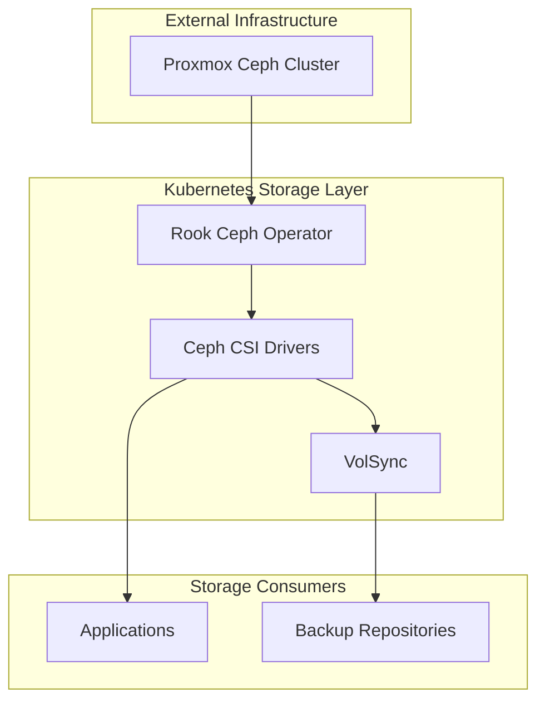

# Storage Applications

> **Note (2025-12-01):** CephFS filesystem was recreated after a failed recovery. All CephFS data pools are empty. Static PVs now use dedicated pools: `cephfs_data`, `cephfs_media`, `cephfs_backups`.

This document covers the storage-related applications and services running in the cluster.

## Storage Stack Overview



## Core Components

### Rook Ceph Operator

**Namespace**: `rook-ceph`
**Type**: Helm Release
**Purpose**: Manages connection to external Ceph cluster and provides CSI drivers

The Rook operator is the bridge between Kubernetes and the external Ceph cluster. It:
- Manages CSI driver deployments
- Maintains connection to Ceph monitors
- Handles authentication and secrets
- Provides CephFS filesystem access

**Configuration**: `kubernetes/apps/rook-ceph/rook-ceph-operator/app/helmrelease.yaml`

**Current Setup**:
- **CephFS Driver**: Enabled ✅
- **RBD Driver**: Enabled ✅
- **Connection Mode**: External cluster
- **Network**: Public network 10.150.0.0/24

**Key Resources**:
```bash
# Check operator status
kubectl -n rook-ceph get pods -l app=rook-ceph-operator

# View operator logs
kubectl -n rook-ceph logs -l app=rook-ceph-operator -f

# Check CephCluster resource
kubectl -n rook-ceph get cephcluster
```

### Rook Ceph Cluster Configuration

**Namespace**: `rook-ceph`
**Type**: CephCluster Custom Resource
**Purpose**: Defines external Ceph cluster connection

**Configuration**: `kubernetes/apps/rook-ceph/rook-ceph-cluster/app/cluster-external.yaml`

This resource tells Rook how to connect to the external Ceph cluster:

```yaml
apiVersion: ceph.rook.io/v1
kind: CephCluster
metadata:
  name: rook-ceph
  namespace: rook-ceph
spec:
  external:
    enable: true
  dataDirHostPath: /var/lib/rook
  cephVersion:
    image: quay.io/ceph/ceph:v18
```

**Monitor Configuration**: Defined in ConfigMap `rook-ceph-mon-endpoints`
- Contains Ceph monitor IP addresses
- Critical for cluster connectivity
- Automatically referenced by CSI drivers

**Authentication**: Stored in Secret `rook-ceph-mon`
- Contains `client.kubernetes` Ceph credentials
- Encrypted with SOPS
- Referenced by all CSI operations

### Ceph CSI Drivers

**Namespace**: `rook-ceph`
**Type**: DaemonSet (nodes) + Deployment (provisioner)
**Purpose**: Enable Kubernetes to mount CephFS volumes

**Components**:
1. **csi-cephfsplugin** (DaemonSet)
   - Runs on every node
   - Mounts CephFS volumes to pods
   - Handles node-level operations

2. **csi-cephfsplugin-provisioner** (Deployment)
   - Creates/deletes CephFS subvolumes
   - Handles dynamic provisioning
   - Manages volume expansion

**Monitoring**:
```bash
# Check CSI pods
kubectl -n rook-ceph get pods -l app=csi-cephfsplugin

# View CSI driver logs
kubectl -n rook-ceph logs -l app=csi-cephfsplugin -c csi-cephfsplugin

# Check provisioner
kubectl -n rook-ceph get pods -l app=csi-cephfsplugin-provisioner
```

### Storage Classes

**Configuration**: `kubernetes/apps/rook-ceph/rook-ceph-cluster/app/storageclasses.yaml`

#### cephfs-shared (Default)

Primary storage class for all dynamic provisioning:

```yaml
apiVersion: storage.k8s.io/v1
kind: StorageClass
metadata:
  name: cephfs-shared
  annotations:
    storageclass.kubernetes.io/is-default-class: "true"
provisioner: rook-ceph.cephfs.csi.ceph.com
parameters:
  clusterID: rook-ceph
  fsName: cephfs
  pool: cephfs_data
allowVolumeExpansion: true
reclaimPolicy: Delete
```

**Usage**: Default for all PVCs without explicit storageClassName

#### cephfs-static

For mounting pre-existing CephFS directories:

```yaml
apiVersion: storage.k8s.io/v1
kind: StorageClass
metadata:
  name: cephfs-static
provisioner: rook-ceph.cephfs.csi.ceph.com
# Used with manually created PVs pointing to existing paths
```

**Usage**: Requires manual PV creation, see examples below

### VolSync

**Namespace**: `storage`
**Type**: Helm Release
**Purpose**: Backup and recovery for Persistent Volume Claims

VolSync provides automated backup of all stateful applications using Restic.

**Configuration**: `kubernetes/apps/storage/volsync/app/helmrelease.yaml`

**Backup Repository**: CephFS-backed PVC
- **Location**: `volsync-cephfs-pvc` (5Ti)
- **Path**: `/repository/{APP}/` for each application
- **Previous**: NFS on vault.manor (migrated to CephFS)

**How It Works**:
1. Applications create `ReplicationSource` resources
2. VolSync creates backup pods with mover containers
3. Mover mounts both application PVC and repository PVC
4. Restic backs up data to repository
5. Retention policies keep configured snapshot count

**Backup Pattern**:
```yaml
apiVersion: volsync.backube/v1alpha1
kind: ReplicationSource
metadata:
  name: my-app
  namespace: my-namespace
spec:
  sourcePVC: my-app-data
  trigger:
    schedule: "0 * * * *"  # Hourly
  restic:
    repository: my-app-restic-secret
    retain:
      hourly: 24
      daily: 7
      weekly: 4
```

**Common Operations**:

```bash
# Manual backup trigger
task volsync:snapshot NS=<namespace> APP=<app>

# List snapshots
task volsync:run NS=<namespace> REPO=<app> -- snapshots

# Unlock repository (if locked)
task volsync:unlock-local NS=<namespace> APP=<app>

# Restore to new PVC
task volsync:restore NS=<namespace> APP=<app>
```

**Repository PVC Configuration**: `kubernetes/apps/storage/volsync/app/volsync-cephfs-pv.yaml`

## Static PV Examples

### Media Storage

Large media library using dedicated cephfs_media pool:

**Location**: `kubernetes/apps/media/storage/app/media-cephfs-pv.yaml`

```yaml
---
apiVersion: v1
kind: PersistentVolume
metadata:
  name: media-cephfs-pv
spec:
  capacity:
    storage: 100Ti
  accessModes:
    - ReadWriteMany
  persistentVolumeReclaimPolicy: Retain
  storageClassName: cephfs-static
  csi:
    driver: rook-ceph.cephfs.csi.ceph.com
    nodeStageSecretRef:
      name: rook-csi-cephfs-static
      namespace: rook-ceph
    volumeAttributes:
      clusterID: rook-ceph
      fsName: cephfs
      staticVolume: "true"
      rootPath: /media
      pool: cephfs_media
      mounter: fuse
---
apiVersion: v1
kind: PersistentVolumeClaim
metadata:
  name: media-cephfs-pvc
  namespace: media
spec:
  accessModes:
    - ReadWriteMany
  resources:
    requests:
      storage: 100Ti
  storageClassName: cephfs-static
  volumeName: media-cephfs-pv
```

**Usage**: Mounted by Plex, Sonarr, Radarr, etc. for media library access

### Minio Object Storage

Minio data stored on CephFS using cephfs_data pool:

**Location**: `kubernetes/apps/storage/minio/app/minio-cephfs-pv.yaml`

```yaml
apiVersion: v1
kind: PersistentVolume
metadata:
  name: minio-cephfs-pv
spec:
  capacity:
    storage: 10Ti
  accessModes:
    - ReadWriteMany
  persistentVolumeReclaimPolicy: Retain
  storageClassName: cephfs-static
  csi:
    driver: rook-ceph.cephfs.csi.ceph.com
    nodeStageSecretRef:
      name: rook-csi-cephfs-static
      namespace: rook-ceph
    volumeAttributes:
      clusterID: rook-ceph
      fsName: cephfs
      staticVolume: "true"
      rootPath: /minio
      pool: cephfs_data
      mounter: fuse
```

### Paperless-ngx Document Storage

Document management system storage using cephfs_data pool:

**Location**: `kubernetes/apps/selfhosted/paperless-ngx/app/paperless-cephfs-pv.yaml`

```yaml
apiVersion: v1
kind: PersistentVolume
metadata:
  name: paperless-cephfs-pv
spec:
  capacity:
    storage: 5Ti
  accessModes:
    - ReadWriteMany
  persistentVolumeReclaimPolicy: Retain
  storageClassName: cephfs-static
  csi:
    driver: rook-ceph.cephfs.csi.ceph.com
    nodeStageSecretRef:
      name: rook-csi-cephfs-static
      namespace: rook-ceph
    volumeAttributes:
      clusterID: rook-ceph
      fsName: cephfs
      staticVolume: "true"
      rootPath: /paperless
      pool: cephfs_data
      mounter: fuse
```

## Storage Operations

### Creating a New Static PV

**Step 1**: Create directory in CephFS (on Proxmox Ceph node)
```bash
# SSH to a Proxmox node and mount CephFS
ceph-fuse /mnt/cephfs
mkdir -p /mnt/cephfs/my-app
chmod 777 /mnt/cephfs/my-app  # Or appropriate permissions
fusermount -u /mnt/cephfs
```

**Step 2**: Create PV manifest
```yaml
apiVersion: v1
kind: PersistentVolume
metadata:
  name: my-app-cephfs-pv
spec:
  capacity:
    storage: 1Ti
  accessModes:
    - ReadWriteMany
  persistentVolumeReclaimPolicy: Retain
  storageClassName: cephfs-static
  csi:
    driver: rook-ceph.cephfs.csi.ceph.com
    nodeStageSecretRef:
      name: rook-csi-cephfs-static
      namespace: rook-ceph
    volumeAttributes:
      clusterID: rook-ceph
      fsName: cephfs
      staticVolume: "true"
      rootPath: /my-app
      pool: cephfs_data  # Or cephfs_media, cephfs_backups
      mounter: fuse
```

**Step 3**: Create PVC manifest
```yaml
apiVersion: v1
kind: PersistentVolumeClaim
metadata:
  name: my-app-cephfs-pvc
  namespace: my-namespace
spec:
  accessModes:
    - ReadWriteMany
  resources:
    requests:
      storage: 1Ti
  storageClassName: cephfs-static
  volumeName: my-app-cephfs-pv
```

**Step 4**: Apply and verify
```bash
kubectl apply -f pv.yaml
kubectl apply -f pvc.yaml
kubectl get pv my-app-cephfs-pv
kubectl get pvc -n my-namespace my-app-cephfs-pvc
```

### Expanding a PVC

CephFS supports online volume expansion:

```bash
# Edit PVC to increase size
kubectl patch pvc my-pvc -n my-namespace -p '{"spec":{"resources":{"requests":{"storage":"20Gi"}}}}'

# Verify expansion
kubectl get pvc -n my-namespace my-pvc -w
```

**Note**: Size can only increase, not decrease

### Troubleshooting Mount Issues

**PVC stuck in Pending**:
```bash
# Check PVC events
kubectl describe pvc -n <namespace> <pvc-name>

# Check CSI driver logs
kubectl -n rook-ceph logs -l app=csi-cephfsplugin -c csi-cephfsplugin --tail=100

# Verify storage class exists
kubectl get sc cephfs-shared
```

**Pod can't mount volume**:
```bash
# Check pod events
kubectl describe pod -n <namespace> <pod-name>

# Verify Ceph cluster connectivity
kubectl -n rook-ceph get cephcluster

# Check Ceph health
kubectl -n rook-ceph exec -it deploy/rook-ceph-tools -- ceph status

# Verify CephFS is available
kubectl -n rook-ceph exec -it deploy/rook-ceph-tools -- ceph fs status
```

**Slow I/O performance**:
```bash
# Check MDS performance
kubectl -n rook-ceph exec -it deploy/rook-ceph-tools -- ceph fs status

# Check OSD performance
kubectl -n rook-ceph exec -it deploy/rook-ceph-tools -- ceph osd perf

# Identify slow operations
kubectl -n rook-ceph exec -it deploy/rook-ceph-tools -- ceph health detail
```

## Monitoring and Alerts

### Key Metrics

Monitor these via Prometheus/Grafana:

1. **Storage Capacity**
   - Ceph cluster utilization
   - Individual PVC usage
   - Growth trends

2. **Performance**
   - CSI operation latency
   - MDS cache hit ratio
   - OSD I/O rates

3. **Reliability**
   - VolSync backup success rate
   - Ceph health status
   - CSI driver availability

### Useful Queries

**Check all PVCs by size**:
```bash
kubectl get pvc -A -o custom-columns=NAMESPACE:.metadata.namespace,NAME:.metadata.name,SIZE:.spec.resources.requests.storage,STORAGECLASS:.spec.storageClassName --sort-by=.spec.resources.requests.storage
```

**Find PVCs using old storage classes**:
```bash
kubectl get pvc -A -o json | jq -r '.items[] | select(.spec.storageClassName == "nfs-csi" or .spec.storageClassName == "mayastor-etcd-localpv") | "\(.metadata.namespace)/\(.metadata.name) - \(.spec.storageClassName)"'
```

**Check Ceph cluster capacity**:
```bash
kubectl -n rook-ceph exec -it deploy/rook-ceph-tools -- ceph df
```

**Monitor VolSync backups**:
```bash
# Check all ReplicationSources
kubectl get replicationsource -A

# Check specific backup status
kubectl get replicationsource -n <namespace> <app> -o jsonpath='{.status.lastSyncTime}'
```

## Backup and Recovery

### VolSync Backup Workflow

1. **Application creates ReplicationSource**
2. **VolSync creates backup pod** (every hour by default)
3. **Restic backs up PVC** to repository
4. **Snapshots retained** per retention policy
5. **Status updated** in ReplicationSource

### Restore Procedures

**Restore to original PVC**:
```bash
# Scale down application
kubectl scale deployment -n <namespace> <app> --replicas=0

# Run restore
task volsync:restore NS=<namespace> APP=<app>

# Scale up application
kubectl scale deployment -n <namespace> <app> --replicas=1
```

**Restore to new PVC**:
1. Create ReplicationDestination pointing to new PVC
2. VolSync will restore data from repository
3. Update application to use new PVC
4. Verify data integrity

### Disaster Recovery

**Complete cluster rebuild**:
1. Deploy new Kubernetes cluster
2. Install Rook with same external Ceph connection
3. Recreate storage classes
4. Deploy VolSync
5. Restore all applications from backups

**CephFS corruption**:
1. Check Ceph health and repair if possible
2. If unrecoverable, restore from VolSync backups
3. VolSync repository is on CephFS, so ensure repository is intact
4. Consider external backup of VolSync repository

## Security Considerations

### Ceph Authentication

- **Client Key**: `client.kubernetes` Ceph user
- **Permissions**: Limited to CephFS pools only
- **Storage**: SOPS-encrypted in `rook-ceph-mon` secret
- **Rotation**: Should be rotated periodically

### PVC Access Control

- **Namespace Isolation**: PVCs are namespace-scoped
- **RBAC**: Control who can create/delete PVCs
- **Pod Security**: Pods must have appropriate security context
- **Network Policies**: Limit which pods can access storage

### Backup Security

- **VolSync Repository**: Protected by Kubernetes RBAC
- **Restic Encryption**: Repository encryption with per-app keys
- **Snapshot Access**: Controlled via ReplicationSource ownership

## Current Status

### RBD Block Storage ✅ Complete

RBD block storage is now fully operational:
- **RBD driver**: Enabled
- **RBD pool**: `rook-pvc-pool` (32 PGs, replicated size 2, snappy compression)
- **Storage class**: `ceph-rbd` (default)
- **Use for**: Databases, single-pod applications requiring high performance

### CephFS Pools ✅ Complete

CephFS now has three dedicated data pools:
- **cephfs_data**: General application data (minio, paperless, etc.)
- **cephfs_media**: Large media files (plex, sonarr, etc.)
- **cephfs_backups**: VolSync backup repositories

### Planned Improvements

- Ceph dashboard integration
- Advanced monitoring dashboards
- Automated capacity alerts
- Storage QoS policies
- Cross-cluster replication

## References

- **Rook Operator**: `kubernetes/apps/rook-ceph/rook-ceph-operator/`
- **Cluster Config**: `kubernetes/apps/rook-ceph/rook-ceph-cluster/`
- **Storage Classes**: `kubernetes/apps/rook-ceph/rook-ceph-cluster/app/storageclasses.yaml`
- **VolSync**: `kubernetes/apps/storage/volsync/`
- **Architecture**: `docs/src/architecture/storage.md`
