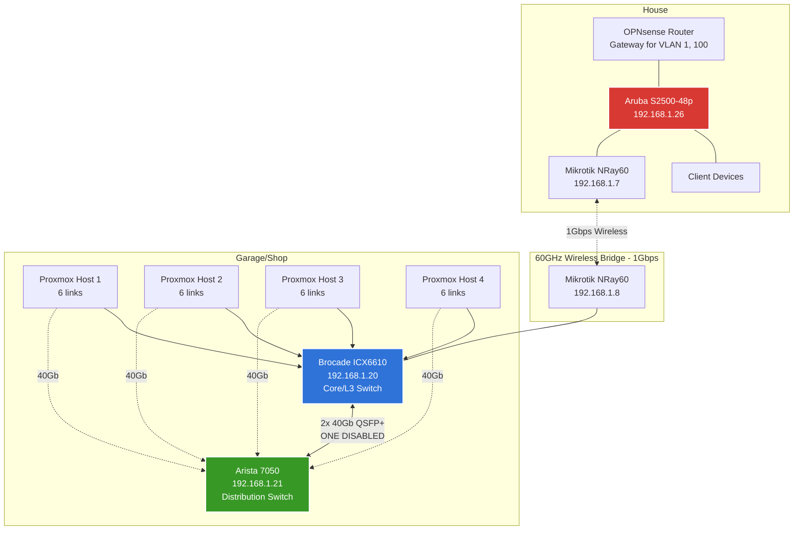
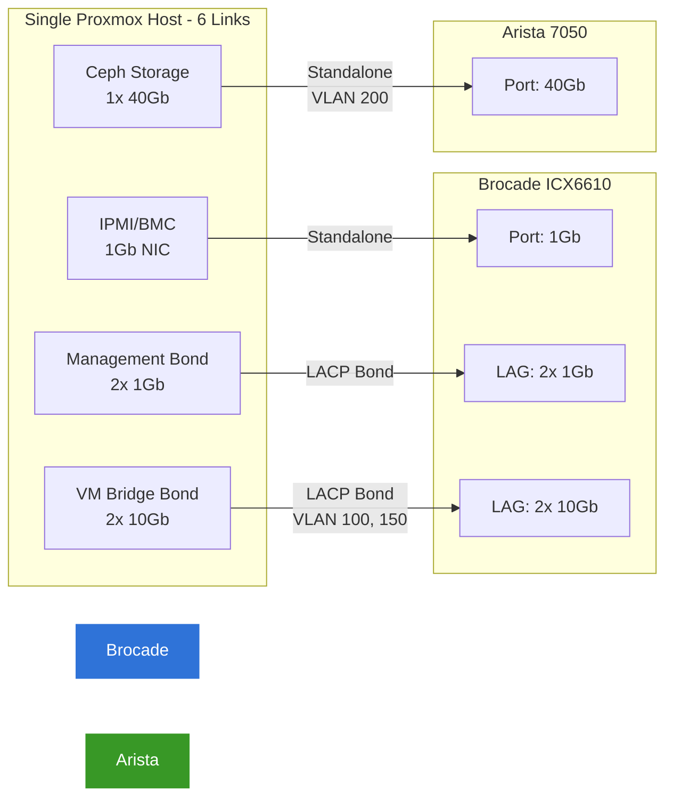
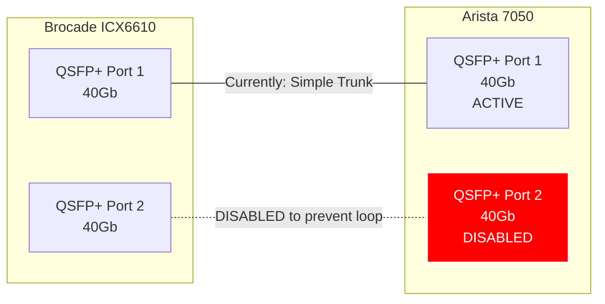
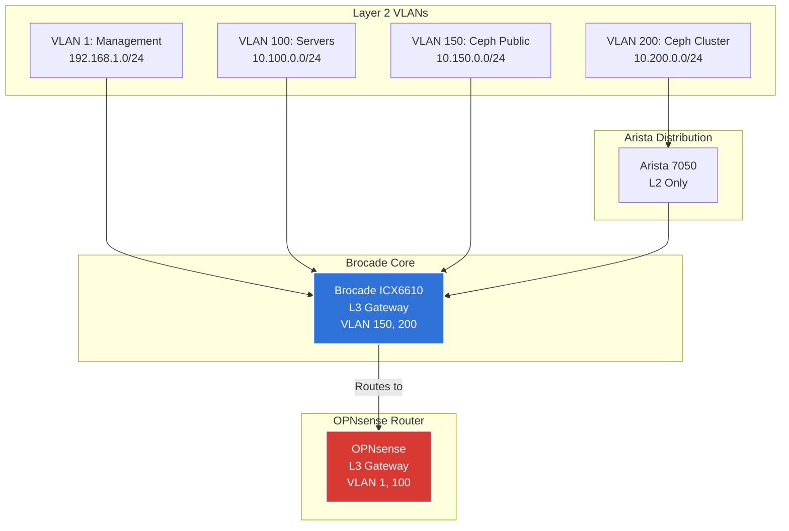

# Network Topology

## Overview

The Dapper Cluster network spans two physical locations (garage/shop and house) connected via a 1Gbps wireless bridge. The network uses a dual-switch design in the garage with high-speed interconnects for server and storage traffic.

## Network Locations

### Garage/Shop (Server Room)
- Primary compute infrastructure
- Core and distribution switches
- 4x Proxmox hosts running Talos/Kubernetes
- High-speed storage network

### House
- Access layer switch
- OPNsense router/firewall
- Client devices
- Connected to garage via 60GHz wireless bridge (1Gbps)

---

## Device Inventory

### Core Network Equipment

| Device | Model | Management IP | Location | Role | Notes |
|--------|-------|---------------|----------|------|-------|
| Brocade Core | ICX6610 | 192.168.1.20 | Garage | Core/L3 Switch | Manages VLAN 150, 200 routing |
| Arista Distribution | 7050 | 192.168.1.21 | Garage | Distribution Switch | High-speed 40Gb interconnects |
| Aruba Access | S2500-48p | 192.168.1.26 | House | Access Switch | PoE, client devices |
| OPNsense Router | i3-4130T - 16GB | 192.168.1.1 | House | Router/Firewall | Manages VLAN 1, 100 routing |
| Mikrotik Radio (House) | NRay60 | 192.168.1.7 | House | Wireless Bridge | 1Gbps to garage |
| Mikrotik Radio (Shop) | NRay60 | 192.168.1.8 | Garage | Wireless Bridge | 1Gbps to house |
| Mikrotik Switch | CSS326-24G-2S | 192.168.1.27 | Garage | Wireless Bridge - Brocade Core | Always up interconnect |

### Compute Infrastructure

| Device | Management IP | IPMI IP | Location | Links | Notes |
|--------|---------------|---------|----------|-------|-------|
| Proxmox Host 1 | 192.168.1.62  | 192.168.1.162 | Garage | 6 total | 3x 1Gb, 2x 10Gb, 1x 40Gb |
| Proxmox Host 2 | 192.168.1.63 | 192.168.1.165 | Garage | 6 total | 3x 1Gb, 2x 10Gb, 1x 40Gb |
| Proxmox Host 3 | 192.168.1.64 | 192.168.1.163 | Garage | 6 total | 3x 1Gb, 2x 10Gb, 1x 40Gb |
| Proxmox Host 4 | 192.168.1.66 | 192.168.1.164 | Garage | 6 total | 3x 1Gb, 2x 10Gb, 1x 40Gb |

### Kubernetes Nodes (VMs on Proxmox)

| Hostname | Primary IP (VLAN 100) | Storage IP (VLAN 150) | Role | Host |
|----------|----------------------|---------------------|------|------|
| talos-control-1 | 10.100.0.50 | 10.150.0.10 | Control Plane | Proxmox-03 |
| talos-control-2 | 10.100.0.51 | 10.150.0.11 | Control Plane | Proxmox-04 |
| talos-control-3 | 10.100.0.52 | 10.150.0.12 | Control Plane | Proxmox-02 |
| talos-node-gpu-1 | 10.100.0.53 | 10.150.0.13 | Worker (GPU) | Proxmox-03 |
| talos-node-large-1 | 10.100.0.54 | 10.150.0.14 | Worker | Proxmox-03 |
| talos-node-large-2 | 10.100.0.55 | 10.150.0.15 | Worker | Proxmox-03 |
| talos-node-large-3 | 10.100.0.56 | 10.150.0.16 | Worker | Proxmox-03 |

**Kubernetes Cluster VIP:** 10.100.0.40 (shared across control plane nodes)

---

## VLAN Configuration

| VLAN ID | Network | Subnet | Gateway | MTU | Purpose | Gateway Device | Notes |
|---------|---------|--------|---------|-----|---------|----------------|-------|
| 1 | LAN | 192.168.1.0/24 | 192.168.1.1 | 1500 | Management, clients | OPNsense | Default VLAN |
| 100 | SERVERS | 10.100.0.0/24 | 10.100.0.1 | 1500 | Kubernetes nodes, VMs | OPNsense | Primary server network |
| 150 | CEPH-PUBLIC | 10.150.0.0/24 | None (internal) | 9000 | Ceph client/monitor | Brocade | Jumbo frames enabled, no gateway needed |
| 200 | CEPH-CLUSTER | 10.200.0.0/24 | None (internal) | 9000 | Ceph OSD replication | Arista | Jumbo frames enabled, no gateway needed |

### Kubernetes Internal Networks
| Network | CIDR | Purpose | MTU |
|---------|------|---------|-----|
| Pod Network | 10.69.0.0/16 | Cilium pod CIDR | 1500 |
| Service Network | 10.96.0.0/16 | Kubernetes services | 1500 |

### VLAN Tagging Summary
- **Tagged (Trunked):** All inter-switch links, Proxmox host uplinks (for VM traffic)
- **Untagged Access Ports:** Client devices on appropriate VLANs
- **[TODO: Document which VLANs are allowed on which trunk ports]**

---

## Physical Topology

### High-Level Site Connectivity



### Proxmox Host Connectivity Detail

Each Proxmox host has 6 network connections:



**Per-Host Link Summary:**
- **IPMI:** 1x 1Gb to Brocade (dedicated management)
- **Proxmox Management:** 2x 1Gb LACP bond to Brocade (Proxmox host IP)
- **VM Traffic:** 2x 10Gb LACP bond to Brocade (bridges for VMs, VLAN 100, 150)
- **Ceph Cluster:** 1x 40Gb to Arista (VLAN 200 only)

**Total Bandwidth per Host:**
- To Brocade: 23 Gbps (3 + 20 Gbps)
- To Arista: 40 Gbps

### Brocade-Arista Interconnect (ISSUE)



**CURRENT ISSUE:**
- 2x 40Gb links are configured as separate trunk ports (default VLAN 1, passing all VLANs)
- This creates a layer 2 loop
- ONE port disabled on Arista side as workaround
- **SOLUTION NEEDED:** Configure proper LACP/port-channel on both switches

**[TODO: Document target LAG configuration]**

---

## Logical Topology

### Layer 2 VLAN Distribution



### Layer 3 Routing

**Primary Gateways:**
- **OPNsense** (at house):
  - VLAN 1: 192.168.1.1
  - VLAN 100: 10.100.0.1
  - Default gateway for internet access
  - 2.5GB ATT Fiber

- **Brocade ICX6610** (at garage):
  - VLAN 1: 192.168.1.20
  - VLAN 100: 10.100.0.10
  - VLAN 150: None
  - VLAN 200: None
  - VIP's that route back to the gateway at 192.168.1.1 or 10.100.0.1

**[TODO: Document inter-VLAN routing rules]**
- Can VLAN 150/200 reach the internet? USER-TODO: (Need to check not sure)
- Are there firewall rules blocking inter-VLAN traffic?
- How does Ceph traffic route if needed?

---

## Traffic Flows

### VLAN 1 (Management) - 192.168.1.0/24
**Purpose:** Switch management, IPMI, admin access

**Flow:**
```
Client (House)
  → Aruba Switch
  → Wireless Bridge (1Gbps)
  → Brocade
  → Switch/IPMI management interface
```

**Devices:**
- All switch management IPs
- Proxmox IPMI interfaces
- Admin workstations
- [TODO: Complete device list]

---

### VLAN 100 (Servers) - 10.100.0.0/24
**Purpose:** Kubernetes nodes, VM primary network

**Flow:**
```
Talos Node (10.100.0.50-56)
  → Proxmox VM Bridge (10Gb bond)
  → Brocade (2x 10Gb bond)
  → Routes through OPNsense for internet
```

**Key Services:**
- Kubernetes API: 10.100.0.40:6443 (VIP)
- Talos nodes: 10.100.0.50-56

**Internet Access:** Yes (via OPNsense gateway)

---

### VLAN 150 (Ceph Public) - 10.150.0.0/24
**Purpose:** Ceph client connections, monitor communication, CSI drivers

**MTU:** 9000 (Jumbo frames)

**Flow:**
```
Kubernetes Pod (needs storage)
  → Rook CSI Driver
  → Talos Node (10.150.0.10-16)
  → Proxmox VM Bridge (10Gb bond)
  → Brocade (2x 10Gb bond)
  → Ceph Monitors on Proxmox hosts
```

**Key Services:**
- Ceph Monitors: 10.150.0.4, 10.150.0.2
- Kubernetes nodes: 10.150.0.10-16 (secondary IPs)
- Rook CSI drivers connect via this network

**Gateway:** None required (internal-only network)
**Internet Access:** Not needed (Ceph storage network)

**Performance:**
- 2x 10Gb bonded links per host
- Jumbo frames (MTU 9000)
- Shared with VLAN 100 on same physical bond

---

### VLAN 200 (Ceph Cluster) - 10.200.0.0/24
**Purpose:** Ceph OSD replication, cluster heartbeat (backend traffic)

**MTU:** 9000 (Jumbo frames)

**Flow:**
```
Ceph OSD on Proxmox Host 1
  → 40Gb link to Arista
  → Arista 7050 (switch fabric)
  → 40Gb link to Proxmox Host 2-4
  → Ceph OSD on other hosts
```

**Key Characteristics:**
- **Dedicated high-speed path:** Uses 40Gb links exclusively
- **East-west traffic only:** OSD-to-OSD replication
- **Does NOT traverse Brocade** for data path
- Arista provides switching for this VLAN

**Gateway:** None required (internal-only network)
**Internet Access:** Not needed (Ceph backend replication only)

**Performance:**
- 40Gbps per host to Arista
- Dedicated bandwidth (not shared with other traffic)
- Jumbo frames critical for large object transfers

**[TODO: Document Proxmox host IPs on this VLAN]**
USER-TODO: Need to choose/ configure

---

### Traffic Segregation Summary

| VLAN | Physical Path | Bandwidth | MTU | Shared? |
|------|--------------|-----------|-----|---------|
| 1 (Management) | 1Gb/10Gb to Brocade | Shared | 1500 | Yes |
| 100 (Servers) | 2x 10Gb bond to Brocade | 20 Gbps | 1500 | Yes (with VLAN 150) |
| 150 (Ceph Public) | 2x 10Gb bond to Brocade | 20 Gbps | 9000 | Yes (with VLAN 100) |
| 200 (Ceph Cluster) | 1x 40Gb to Arista | 40 Gbps | 9000 | No (dedicated) |

---

## Switch Configuration

### Brocade ICX6610 Configuration

**Role:** Core L3 switch, VLAN routing for 150/200

**Port Assignments:**
```
[TODO: Document port assignments]

Example:
- Ports 1/1/1-4: IPMI connections (VLAN 1 untagged)
- Ports 1/1/5-12: Proxmox management bonds (LAG groups)
- Ports 1/1/13-20: Proxmox 10Gb bonds (LAG groups, trunk VLAN 100, 150)
- Ports 1/1/41-42: 40Gb to Arista (LAG group, trunk all VLANs)
- Port 1/1/48: Uplink to Mikrotik (trunk all VLANs)
```

**VLAN Interfaces (SVI):**
```
[TODO: Brocade config snippet]

interface ve 1
  ip address 192.168.1.20/24

interface ve 150
  ip address [TODO]/24
  mtu 9000

interface ve 200
  ip address [TODO]/24
  mtu 9000
```

**Static Routes:**
```
[TODO: Document static routes to OPNsense]
```

### Arista 7050 Configuration

**Role:** High-speed distribution for VLAN 200 (Ceph cluster)

**Port Assignments:**
```
[TODO: Document port assignments]

Example:
- Ports Et1-4: Proxmox 40Gb links (VLAN 200 tagged)
- Ports Et49-50: 40Gb to Brocade (port-channel, trunk all VLANs)
```

**Configuration:**
```
[TODO: Arista config snippet for port-channel]
```

### Aruba S2500-48p Configuration

**Role:** Access switch at house

**Uplink:** Via Mikrotik wireless bridge to garage

```
[TODO: Document VLAN configuration and port assignments]
```

---

## Common Configuration Tasks

### Fix Brocade-Arista LAG Issue

**Current State:** One 40Gb link disabled to prevent loop

**Target State:** Both 40Gb links in LACP port-channel

**Brocade Configuration:**
```
[TODO: Brocade LACP config]

lag "brocade-to-arista" dynamic id [lag-id]
  ports ethernet 1/1/41 to 1/1/42
  primary-port 1/1/41
  deploy

interface ethernet 1/1/41
  link-aggregate active

interface ethernet 1/1/42
  link-aggregate active
```

**Arista Configuration:**
```
[TODO: Arista LACP config]

interface Port-Channel1
  description Link to Brocade ICX6610
  switchport mode trunk
  switchport trunk allowed vlan 1,100,150,200

interface Ethernet49
  channel-group 1 mode active
  description Link to Brocade 40G-1

interface Ethernet50
  channel-group 1 mode active
  description Link to Brocade 40G-2
```

---

## Performance Characteristics

### Bandwidth Allocation

**Total Uplink Capacity (Garage to House):**
- 1 Gbps (Mikrotik 60GHz bridge)
- **Bottleneck:** All VLAN 1 and internet-bound traffic limited to 1Gbps

**Garage Internal Bandwidth:**
- Brocade to Hosts: 92 Gbps aggregate (12x 1Gb + 8x 10Gb bonds)
- Arista to Hosts: 160 Gbps (4x 40Gb)
- Brocade-Arista: 40 Gbps (when LAG working: 80 Gbps)

### Expected Traffic Patterns

**High Bandwidth Flows:**
1. Ceph OSD replication (VLAN 200) - 40Gb per host
2. Ceph client I/O (VLAN 150) - 20Gb shared per host
3. VM network traffic (VLAN 100) - 20Gb shared per host

**Constrained Flows:**
1. Internet access - limited to 1Gbps wireless bridge
2. Management traffic - shared 1Gbps wireless bridge

---

## Troubleshooting Reference

### Connectivity Testing

**Test Management Access:**
```bash
# From any client
ping 192.168.1.20  # Brocade
ping 192.168.1.21  # Arista
ping 192.168.1.26  # Aruba

# Test across wireless bridge
ping 192.168.1.7   # Mikrotik House
ping 192.168.1.8   # Mikrotik Shop
```

**Test VLAN 100 (Servers):**
```bash
ping 10.100.0.40   # Kubernetes VIP
ping 10.100.0.50   # Talos control-1
```

**Test VLAN 150 (Ceph Public):**
```bash
ping 10.150.0.10   # Talos control-1 storage interface
```

### Check Link Aggregation Status

**Brocade:**
```
show lag
show interface ethernet 1/1/41
show interface ethernet 1/1/42
```

**Arista:**
```
show port-channel summary
show interface ethernet 49
show interface ethernet 50
```

### Monitor Traffic

**Brocade:**
```
show interface ethernet 1/1/41 | include rate
show interface ethernet 1/1/42 | include rate
```

**Check VLAN configuration:**
```
show vlan
show interface brief
```

---

## Known Issues and Gotchas

### Active Issues

1. **Brocade-Arista Interconnect Loop**
   - **Symptom:** Network storms, high CPU on switches, connectivity issues
   - **Current Workaround:** One 40Gb link disabled on Arista side
   - **Root Cause:** Links configured as separate trunks instead of LAG
   - **Solution:** Configure LACP/port-channel on both switches (see above)

2. **[TODO: Document other known issues]**

### Design Considerations

1. **Wireless Bridge Bottleneck**
   - All internet traffic and house-to-garage limited to 1Gbps
   - Management access during wireless outage is difficult
   - Consider: OOB management network or local crash cart access

2. **Single Point of Failure**
   - Wireless bridge failure isolates garage from house
   - Brocade failure loses routing for VLAN 150/200
   - Consider: Redundancy strategy

3. **VLAN 200 Routing**
   - If gateway is on Brocade but traffic flows through Arista, need to verify routing
   - Confirm: Does VLAN 200 need a gateway at all? (internal only)

---

## Future Improvements

**[TODO: Document planned network changes]**

- [ ] Fix Brocade-Arista LAG to enable second 40Gb link
- [ ] Document complete port assignments for all switches
- [ ] Add network monitoring/observability (Prometheus exporters?)
- [ ] Consider redundant wireless link or fiber between buildings
- [ ] Implement proper change management for switch configs
- [ ] [TODO: Add your planned improvements]

---

## Change Log

| Date | Change | Person | Notes |
|------|--------|--------|-------|
| 2025-10-14 | Initial documentation created | Claude | Baseline network topology documentation |
| [TODO] | [TODO] | [TODO] | [TODO] |

---

## References

- Talos Configuration: `kubernetes/bootstrap/talos/talconfig.yaml`
- Network Patches: `kubernetes/bootstrap/talos/patches/global/machine-network.yaml`
- Kubernetes Network: See `docs/src/architecture/network.md` for application-level networking
- Storage Network: See `docs/src/architecture/storage.md` for Ceph network details
