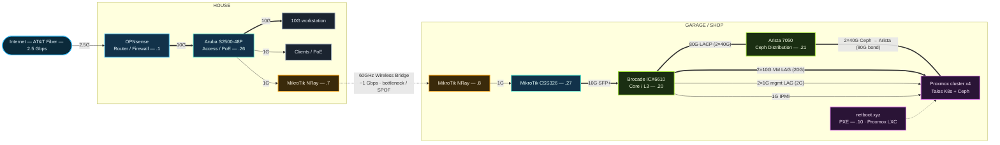

# Network Topology

> Current physical / L2 / L3 topology of the homelab switching fabric.
> **Verified live from every switch on 2026-06-30** (Brocade, Arista, Aruba, both Mikrotik NRay
> radios). The Mikrotik CSS326 is SwOS web-only; its role here is confirmed from neighbor
> discovery on adjacent devices.

The network spans two buildings — **house** and **garage/shop** — joined by a single 60GHz
wireless bridge (~1 Gbps). The garage holds the core (Brocade) and the high-speed Ceph
distribution switch (Arista); the house holds the access switch (Aruba) and the OPNsense router.

## Bandwidth & Link Diagram

> At-a-glance view of devices, links, and aggregated speeds. Rendered from the Mermaid
> source below (kept in-doc as the source of truth for the topology infographic).


```mermaid
flowchart LR
internet([Internet — AT&T Fiber — 2.5 Gbps]):::wan

  subgraph HOUSE
    direction TB
    opn[OPNsense<br/>Router / Firewall — .1]:::fw
    aruba[Aruba S2500-48P<br/>Access / PoE — .26]:::sw
    ws[10G workstation]:::client
    clients[Clients / PoE]:::client
    nray7[MikroTik NRay — .7]:::radio
  end

  subgraph GARAGE_SHOP[GARAGE / SHOP]
    direction TB
    nray8[MikroTik NRay — .8]:::radio
    css[MikroTik CSS326 — .27]:::sw
    brocade[Brocade ICX6610<br/>Core / L3 — .20]:::core
    arista[Arista 7050<br/>Ceph Distribution — .21]:::core
    pmox[Proxmox cluster x4<br/>Talos K8s + Ceph]:::server
    netboot[netboot.xyz<br/>PXE — .10 · Proxmox LXC]:::server
  end

  internet -->|2.5G| opn
  opn ==>|10G| aruba
  aruba ==>|10G| ws
  aruba -->|1G| clients
  aruba -->|1G| nray7
  nray7 -. "60GHz Wireless Bridge<br/>~1 Gbps · bottleneck / SPOF" .-> nray8
  nray8 -->|1G| css
  css ==>|10G SFP+| brocade
  brocade ====|"80G LACP (2×40G)"| arista
  arista ====|"2×40G Ceph → Arista (80G bond)"| pmox
  brocade ==>|"2×10G VM LAG (20G)"| pmox
  brocade -->|"2×1G mgmt LAG (2G)"| pmox
  brocade -->|1G IPMI| pmox
  netboot -.-> pmox

  classDef wan     fill:#0b2a3a,stroke:#38bdf8,color:#e6f6ff,stroke-width:2px;
  classDef fw      fill:#12324a,stroke:#38bdf8,color:#e6f6ff,stroke-width:2px;
  classDef sw      fill:#12324a,stroke:#5eead4,color:#e6fffb,stroke-width:2px;
  classDef core    fill:#1a2e12,stroke:#a3e635,color:#f7ffe6,stroke-width:2px;
  classDef server  fill:#2a1436,stroke:#e879f9,color:#fdebff,stroke-width:2px;
  classDef radio   fill:#3a2a0b,stroke:#f59e0b,color:#fff7e6,stroke-width:2px;
  classDef client  fill:#1b2430,stroke:#94a3b8,color:#e2e8f0,stroke-width:2px;
```

---

## Device Inventory

| Device                | Model          | Mgmt IP      | OS / firmware         | Location | Role                                   |
| --------------------- | -------------- | ------------ | --------------------- | -------- | -------------------------------------- |
| Brocade core          | ICX6610-48P    | 192.168.1.20 | FastIron 08.0.30uT7f3 | Garage   | Core / L3 switch (VLAN 1/100/200 SVIs) |
| Arista distribution   | DCS-7050QX-32  | 192.168.1.21 | EOS 4.20.11M          | Garage   | Ceph distribution, L2 only (40G)       |
| Aruba access          | S2500-48P      | 192.168.1.26 | ArubaOS MAS 7.4.1.12  | House    | Access switch, PoE, clients            |
| Mikrotik NRay (house) | nRAYG-60ad     | 192.168.1.7  | RouterOS 7.18.2       | House    | 60GHz bridge — AP side                 |
| Mikrotik NRay (shop)  | nRAYG-60ad     | 192.168.1.8  | RouterOS 7.18.2       | Garage   | 60GHz bridge — station side            |
| Mikrotik CSS326       | CSS326-24G-2S+ | 192.168.1.27 | SwOS 2.18             | Garage   | Wireless-bridge ↔ Brocade aggregation  |
| OPNsense router       | —              | 192.168.1.1  | OPNsense              | House    | Router / firewall, L3 for VLAN 1/100   |

All switch management interfaces sit on VLAN 1 (192.168.1.0/24).

---

## VLANs

| VLAN | Name         | Subnet         | Gateway / SVI                | MTU  | Purpose                            |
| ---- | ------------ | -------------- | ---------------------------- | ---- | ---------------------------------- |
| 1    | DEFAULT      | 192.168.1.0/24 | OPNsense 192.168.1.1         | 1500 | Management, IPMI, clients (native) |
| 20   | LAB          | —              | none                         | 1500 | Lab segment (L2-only, Brocade)     |
| 100  | KUBERNETES   | 10.100.0.0/24  | OPNsense 10.100.0.1          | 1500 | Talos/k8s nodes, VMs, LB pool      |
| 150  | CEPH-PUBLIC  | 10.150.0.0/24  | none (no SVI anywhere)       | 9000 | Ceph client/monitor (jumbo)        |
| 200  | CEPH-STORAGE | 10.200.0.0/24  | Brocade ve200 = 10.200.0.254 | 9000 | Ceph OSD replication (jumbo)       |

- **VLAN 1** is the untagged/native VLAN on every switch trunk port (Brocade `dual-mode 1`,
  Arista/Aruba native 1).
- **VLAN 20 (LAB)** is defined and trunked on the **Brocade only**. Arista carries it in its
  trunk allowed-lists but it is not instantiated in the Arista VLAN database; Aruba does not carry it.
- **VLAN 150** has **no L3 interface on any switch** — purely L2, jumbo frames, gateway-less.
- **VLAN 200** has a single SVI: **Brocade `ve200` 10.200.0.254/24**. It is otherwise
  internal/east-west only.

### Kubernetes internal networks (Cilium, not switched)

| Network         | CIDR         | Purpose             |
| --------------- | ------------ | ------------------- |
| Pod network     | 10.69.0.0/16 | Cilium pod CIDR     |
| Service network | 10.96.0.0/16 | Kubernetes services |

---

## Layer 3 / Routing (verified)

- **OPNsense** (house) — default gateway for VLAN 1 (192.168.1.1) and VLAN 100 (10.100.0.1).
  Upstream internet: **AT&T Fiber, 2.5 Gbps**. Connects to the house fabric over **10G fiber**
  (`mce0`/`mce1`, `10Gbase-SR`, both active) — this is the house backbone.
- **Brocade ICX6610** — SVIs: `ve1` 192.168.1.20/24, `ve100` 10.100.0.10/24,
  `ve200` 10.200.0.254/24. Jumbo frames enabled globally. Two default routes point at OPNsense:
  `0.0.0.0/0 → 192.168.1.1` and `0.0.0.0/0 → 10.100.0.1`.
- **Arista 7050** — `no ip routing`; pure L2. Management only: `Management1` 192.168.1.21/24,
  default route `0.0.0.0/0 → 192.168.1.1`.
- **Aruba S2500** — L2 access. `vlan 1` IP via DHCP (currently 192.168.1.26),
  `vlan 100` 10.100.0.26/24, dedicated OOB `mgmt` port 172.16.0.254/24. **10G SFP+ to OPNsense**
  (house backbone); can serve **10G to select house clients** (e.g. a workstation), 1G to the rest.

---

## DNS Resolution (verified 2026-07-01)

Name resolution is layered, with a garage-local failover so the cluster keeps resolving through a
60GHz bridge outage:

- **OPNsense Unbound** — `192.168.1.1` / `10.100.0.1` (house). **Primary resolver** for all VLANs:
  recursive + DNSBL filtering, and forwards the internal split-horizon domains to the in-cluster
  k8s-gateway.
- **Garage Unbound** — `10.100.0.2` (Proxmox LXC `unbound-garage`, CT 110 on proxmox-04, VLAN 100).
  **Failover resolver**, garage-local. Mirrors the house: forwards the same internal domains to
  k8s-gateway, and forwards everything else **upstream to OPNsense** (`10.100.0.1`) so external DNS
  still passes the firewall's DNSBL/logging.
- **k8s-gateway** — LB VIP `10.100.0.21`. Authoritative for the internal split-horizon domains
  (`chelonianlabs.com`, `turtleassmedia.com`, `derekmackley.com`, `dapperdivers.com`), returning
  in-cluster gateway VIPs. Both resolvers above delegate these domains to it.

Talos node resolvers (`machine.network.nameservers`, all 11 nodes): **`10.100.0.1` primary,
`10.100.0.2` fallback**. During a bridge cut the garage resolver keeps internal + cached names
resolving; external names need WAN and are unavailable regardless.

## Network Boot (PXE)

`netboot.xyz` runs as Proxmox LXC `netboot-xyz` (CT 111, `192.168.1.10`, mgmt VLAN). OPNsense DHCP
hands PXE clients on **both VLAN 1 and VLAN 100** `next-server 192.168.1.10` plus the netboot.xyz
bootloader over TFTP, which chainloads the netboot.xyz menu over HTTP. Talos VMs boot **disk-first**
and only fall through to PXE if the disk is unbootable; netboot.xyz's built-in **Talos** entry can
then boot the stock Talos image into maintenance mode for `talosctl`.

---

## Inter-Site Path (house ↔ garage)

The only data path between buildings is the 60GHz wireless bridge. The verified end-to-end chain:

```
House clients / OPNsense (192.168.1.1)
  └─ Aruba S2500  ── GE0/0/21 ──▶ NRay-house ether1
        NRay-house  ))) 60GHz, 58320 MHz, ~1 Gbps  (((  NRay-shop
                                   NRay-shop ether1 ──▶ CSS326
                                        CSS326 ──(SFP+ 10G)──▶ Brocade 1/3/1 "Uplink-10Gb-Primary"
                                                                  └─ garage fabric
```

- **Aruba GE0/0/21 → NRay-house ether1** — LLDP-confirmed from the Aruba.
- **NRay-shop ether1 → CSS326 (192.168.1.27)** — MNDP/neighbor-confirmed on the NRay.
- **CSS326 → Brocade `1/3/1` ("Uplink-10Gb-Primary", up at 10G)** — the Brocade's only active
  uplink port and the CSS326's SFP+ uplink; this is the garage-side landing of the bridge path.
- Brocade `1/1/1` ("Uplink-1G-Backup") is **administratively disabled**.
- The bridge is **transparent L2** — both NRays bridge `ether1`+`wlan60` with no VLAN filtering,
  so all VLANs (1/100/…) cross it. Effective throughput is gated to ~1 Gbps by the 60GHz link and
  the radios' gigabit `ether1` ports.

### 60GHz link health (verified 2026-06-30)

| Metric            | NRay-house (AP / `mode=bridge`) | NRay-shop (`mode=station-bridge`) |
| ----------------- | ------------------------------- | --------------------------------- |
| Connected         | yes                             | yes                               |
| Frequency         | 58320 MHz                       | 58320 MHz                         |
| RSSI / signal     | −51 / 55                        | −50 / 70                          |
| TX MCS / PHY rate | 4 / 1.155 Gbps                  | 6 / 1.540 Gbps                    |
| TX packet errors  | 0                               | 0                                 |

---

## Brocade ICX6610 — Core (verified port map)

Module layout: `1/1` = 48× 1G PoE, `1/2` = QSFP/10G module, `1/3` = 8× 10G dual-mode.
Every port is `dual-mode 1` (untagged VLAN 1) and tagged for VLANs 1, 20, 100, 150, 200.

### Server / host LAGs (dynamic = LACP)

Each hypervisor presents three connections to the core: a single 1G IPMI port, a 2×1G management
LAG, and a 2×10G VM-traffic LAG.

| Host   | IPMI port | Mgmt LAG (2×1G)             | VM LAG (2×10G)          |
| ------ | --------- | --------------------------- | ----------------------- |
| Px03   | 1/1/7     | id7 `px03-mgmt` 1/1/21-22   | id2 `px03-vm` 1/2/2-3   |
| Px04   | 1/1/8     | id8 `px04-mgmt` 1/1/19-20   | id3 `px04-vm` 1/2/4-5   |
| Circe  | 1/1/9     | id9 `circe-mgmt` 1/1/17-18  | id1 `circe-vm` 1/3/4-5  |
| Athena | 1/1/6     | id6 `athena-mgmt` 1/1/23-24 | id4 `athena-vm` 1/3/2-3 |
| Tower  | 1/1/10    | id10 `tower-mgmt` 1/1/15-16 | id5 `tower-vm` 1/3/6-7  |

- **Athena** — all of its links (IPMI, mgmt LAG, VM LAG) are **currently down** (host offline at
  verification time).
- **Tower** has the same 1G/10G attachment to the core as a hypervisor but **no 40G link to the
  Arista** (it is not a Ceph OSD node).

### Interconnect & infrastructure ports

| Port(s)      | LAG / name               | Use                                                      |
| ------------ | ------------------------ | -------------------------------------------------------- |
| 1/2/1, 1/2/6 | id11 `brocade-to-arista` | **80G LACP** to Arista Po1 (lacp-timeout short), both up |
| 1/3/1        | "Uplink-10Gb-Primary"    | 10G uplink toward CSS326 / wireless bridge (up)          |
| 1/1/1        | "Uplink-1G-Backup"       | Backup uplink — **disabled**                             |
| 1/1/47       | "Zigbee-Router" (PoE)    | Zigbee coordinator                                       |
| 1/1/48       | "UniFi-AP" (PoE)         | UniFi access point                                       |

### SVIs

```
interface ve 1    ip address 192.168.1.20  255.255.255.0
interface ve 100  ip address 10.100.0.10   255.255.255.0
interface ve 200  ip address 10.200.0.254  255.255.255.0
```

---

## Arista 7050 — Ceph Distribution (verified port map)

L2-only (`no ip routing`), MSTP, all switched ports MTU 9214 (jumbo), trunking VLANs
1, 20, 100, 150, 200.

| Port-channel | Members (2×40G LACP) | Description / neighbor               | State |
| ------------ | -------------------- | ------------------------------------ | ----- |
| Po1          | Et25, Et26           | "Link to Brocade ICX6610" — 80G      | up    |
| Po2          | Et1/1, Et2/1         | Proxmox-01-Bond (`proxmox-01.manor`) | up    |
| Po3          | Et3/1, Et4/1         | Proxmox-02-Bond                      | up    |
| Po4          | Et5/1, Et6/1         | Proxmox-03-Bond                      | up    |
| Po5          | Et7/1, Et8/1         | Proxmox-04-Bond (`Proxmox-04.manor`) | up    |

- Et9/1 and Et10/1 are spare 40G ports (no channel-group).
- VLAN database: 1 (default), 100 (kubernetes), 150 (ceph-public), 200 (ceph-storage).

The four Proxmox/Ceph hypervisors each carry their **VLAN 200 (and 150)** Ceph traffic over a
dedicated 2×40G LACP bond to the Arista. Ceph OSD replication stays east-west on this switch and
does not traverse the Brocade.

---

## Aruba S2500-48P — House Access (verified)

ArubaOS MAS, MSTP + LACP, carries **VLAN 1 (untagged/native) and VLAN 100** only — no Ceph VLANs.

- **Default ports**: trunk (VLAN 1 native + VLAN 100 tagged).
- **VLAN-100 access ports**: GE0/0/38 and GE0/0/40 (`switching-profile "Servers"`, native VLAN 100).
- **Garage uplink**: GE0/0/21 → NRay-house `ether1` (LLDP-confirmed).
- **Management**: VLAN 1 via DHCP (192.168.1.26), VLAN 100 = 10.100.0.26/24, OOB `mgmt` = 172.16.0.254/24.

LLDP neighbors at verification time: GE0/0/21 MikroTik NRay-house, GE0/0/25 ACMesh AP,
GE0/0/29 UniFi U6-Plus AP, GE0/0/20 a wired client, GE0/1/0 a server-class host.

---

## Mikrotik 60GHz Bridge (verified)

Both radios run RouterOS 7.18.2 on `nRAYG-60ad` hardware, each with a single bridge named
"Wireless Bridge" containing `ether1` + the 60GHz interface, `vlan-filtering=no` (transparent),
MTU 1500.

- **NRay-house (192.168.1.7)** — `wlan60-1 mode=bridge` (AP). `ether1` → Aruba GE0/0/21.
- **NRay-shop (192.168.1.8)** — `wlan60-1 mode=station-bridge`. `ether1` → CSS326.
- Both addresses are DHCP leases from OPNsense on VLAN 1.

---

## Mikrotik CSS326 (verified from config 2026-06-30)

`CSS326-24G-2S+` running SwOS 2.18 at 192.168.1.27 — the garage-side aggregation point for the
wireless bridge. The NRay-shop's `ether1` lands on a 1G port here (neighbor-confirmed), and one of
the **SFP+ ports (SFP1/SFP2)** provides the 10G uplink to the Brocade core (`1/3/1`).

- **24× 1G (Port1–24) + 2× SFP+ (SFP1/SFP2)**; all ports use **default names** (the config carries no
  custom labels, so the NRay-shop vs Brocade ports are identified only by neighbor discovery).
- **Transparent L2 passthrough**: per-port VLAN mode = _optional_ with default VID 1, full-mesh
  forwarding (no port isolation), RSTP on all ports. It forwards tagged VLANs by their tag and treats
  untagged frames as VLAN 1 — so VLAN 1 (mgmt) and 100 (servers) cross it unchanged.
- Management: DHCP (currently 192.168.1.27), static fallback 192.168.88.1. Identity is still the
  default "MikroTik"; SNMP enabled with community `public`.
- The switch also has a set of **defined-but-unenforced VLAN names** left in its table — 2 (MGMT),
  3 (PTP), 20 (LAB), 30 (DEMO), 100 (KUBERNETES). Because VLAN mode is _optional_ (not strict),
  these are not enforced and do not match the rest of the fabric; they appear to be stale/experimental
  entries. No LACP, no ACLs configured.

---

## Compute Attachment Summary

Five hosts attach to the core; four of them are also Ceph OSD nodes on the Arista.

| Host (switch label) | To Brocade (IPMI + 2×1G mgmt + 2×10G VM) | To Arista (2×40G Ceph) | Notes                  |
| ------------------- | ---------------------------------------- | ---------------------- | ---------------------- |
| Px03                | yes                                      | yes                    | hypervisor / Ceph node |
| Px04                | yes                                      | yes                    | hypervisor / Ceph node |
| Circe               | yes                                      | yes                    | hypervisor / Ceph node |
| Athena              | yes (currently offline)                  | yes (offline)          | hypervisor / Ceph node |
| Tower               | yes                                      | no                     | non-Ceph (NAS/aux)     |

Per-host management IPs are 192.168.1.62–.66 (IPMI 192.168.1.162–.165); see
[hardware.md](hardware.md) for chassis detail and the Talos/k8s VM addressing in the cluster
configuration.

---

## Traffic Segregation

| VLAN               | Path                                             | MTU  |
| ------------------ | ------------------------------------------------ | ---- |
| 1 (Management)     | All trunks; house↔garage over the ~1 Gbps bridge | 1500 |
| 100 (Servers)      | 2×10G VM bond → Brocade; routed by OPNsense      | 1500 |
| 150 (Ceph Public)  | 2×10G VM bond → Brocade (shared with VLAN 100)   | 9000 |
| 200 (Ceph Cluster) | 2×40G bond → Arista (dedicated east-west)        | 9000 |

---

## Verification Commands

```bash
# Reachability
ping 192.168.1.20   # Brocade   192.168.1.21  # Arista   192.168.1.26  # Aruba
ping 192.168.1.7    # NRay-house 192.168.1.8   # NRay-shop 192.168.1.27 # CSS326

# Brocade (FastIron)
show vlan brief
show interface brief
show running-config

# Arista (EOS)
show port-channel summary
show interfaces description
show lldp neighbors

# Aruba (ArubaOS MAS)
show vlan
show port status
show lldp neighbor

# Mikrotik NRay (RouterOS)
/interface w60g monitor wlan60-1 once
/ip neighbor print detail
```
