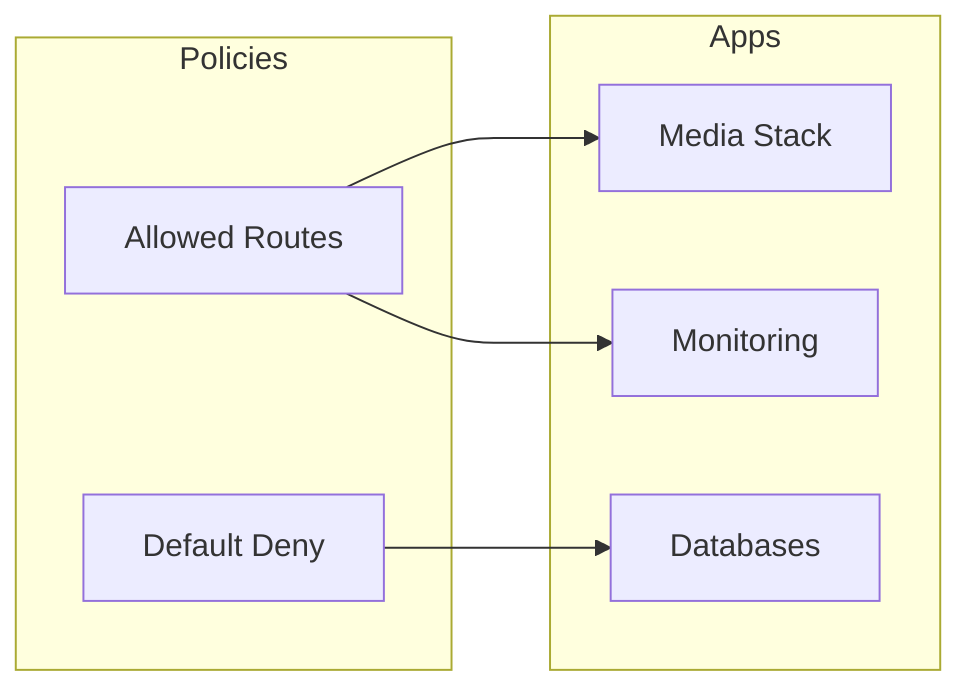
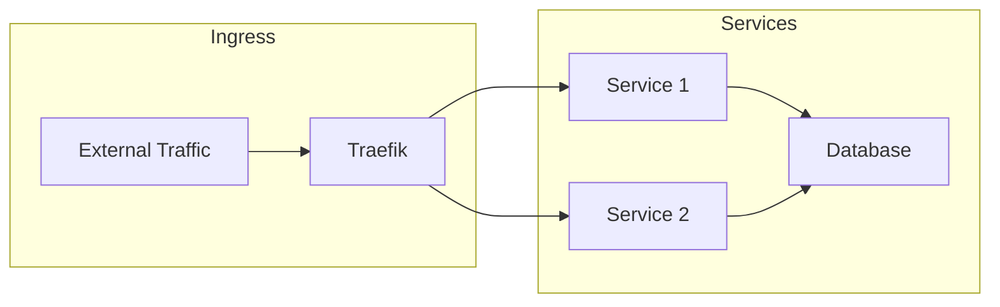

# Network Architecture

This document covers the Kubernetes application-level networking. For physical network topology and VLAN configuration, see [Network Topology](network-topology.md).

## Container Networking (CNI)

### Cilium CNI
The cluster uses **Cilium** as the primary Container Network Interface (CNI):

- **Pod CIDR**: 10.69.0.0/16 (native routing mode)
- **Service CIDR**: 10.96.0.0/16
- **Mode**: Non-exclusive (paired with Multus for multi-network support)
- **Kube-Proxy Replacement**: Enabled (eBPF-based service load balancing)
- **Load Balancing Algorithm**: Maglev with DSR (Direct Server Return)
- **Network Policy**: Endpoint routes enabled
- **BPF Masquerading**: Enabled for outbound traffic

**Key Features**:
- High-performance eBPF data plane
- Native Kubernetes network policy support
- L2 announcements for external load balancer IPs
- Advanced observability and monitoring

### Multus CNI (Multiple Networks)
**Multus** provides additional network interfaces to pods beyond the primary Cilium network:

- **Primary Use**: IoT network attachment (VLAN-based isolation)
- **Network Attachment**: macvlan on ens19 interface
- **Mode**: Bridge mode with DHCP IPAM
- **Purpose**: Enable pods to connect to additional networks (e.g., IoT devices, legacy systems)

Pods can request additional networks via annotations:
```yaml
metadata:
  annotations:
    k8s.v1.cni.cncf.io/networks: macvlan-conf
```

## Ingress Controllers

The cluster uses **dual ingress-nginx controllers** for traffic routing:

### Internal Ingress
- **Class**: `internal` (default)
- **Purpose**: Internal services, private DNS
- **Version**: v4.13.3
- **Load Balancer**: Cilium L2 announcement
- **DNS**: Synced to internal DNS via k8s-gateway and External-DNS (UniFi webhook)

### External Ingress
- **Class**: `external`
- **Purpose**: Public-facing services
- **Version**: v4.13.3
- **Load Balancer**: Cilium L2 announcement
- **DNS**: Synced to Cloudflare via External-DNS
- **Tunnel**: Cloudflared for secure access

## Load Balancer IP Management

### Cilium L2 Announcements
Cilium's L2 announcement feature provides load balancer IPs for services:

- **How it works**: Cilium announces load balancer IPs via L2 (ARP/NDP)
- **Policy-based**: L2AnnouncementPolicy defines which services get announced
- **Benefits**:
  - No external load balancer required
  - Native Kubernetes LoadBalancer service type support
  - High availability through leader election
  - Automatic failover

**Configuration**: See `kubernetes/apps/kube-system/cilium/config/l2.yaml`

This enables both ingress controllers to receive external IPs that are accessible from the broader network.

### Network Policies


## DNS Configuration

### Internal DNS (k8s-gateway)
- **Purpose**: DNS server for internal ingresses
- **Domain**: Internal cluster services
- **Integration**: Works with External-DNS for automatic record creation

### External-DNS (Dual Instances)

**Instance 1: Internal DNS**
- **Provider**: UniFi (via webhook provider)
- **Target**: UDM Pro Max
- **Ingress Class**: `internal`
- **Purpose**: Sync private DNS records for internal services

**Instance 2: External DNS**
- **Provider**: Cloudflare
- **Ingress Class**: `external`
- **Purpose**: Sync public DNS records for externally accessible services

### How DNS Works
1. Create an Ingress with class `internal` or `external`
2. External-DNS watches for new/updated ingresses
3. Appropriate External-DNS instance syncs DNS records to target provider
4. Services become accessible via their configured hostnames

## Security

### Network Policies
```yaml
apiVersion: networking.k8s.io/v1
kind: NetworkPolicy
metadata:
  name: default-deny
spec:
  podSelector: {}
  policyTypes:
  - Ingress
  - Egress
```

### TLS Configuration
- Automatic certificate management via cert-manager
- Let's Encrypt integration
- Internal PKI for service mesh

## Service Mesh

### Traffic Flow


## Best Practices

1. **Security**
   - Implement default deny policies
   - Use TLS everywhere
   - Regular security audits
   - Network segmentation

2. **Performance**
   - Load balancer optimization
   - Connection pooling
   - Proper resource allocation
   - Traffic monitoring

3. **Reliability**
   - High availability configuration
   - Failover planning
   - Backup routes
   - Health checks

4. **Monitoring**
   - Network metrics collection
   - Traffic analysis
   - Latency monitoring
   - Bandwidth usage tracking

## Troubleshooting

Common network issues and resolution steps:
1. **Connectivity Issues**
   - Check network policies
   - Verify DNS resolution
   - Inspect service endpoints
   - Review ingress configuration

2. **Performance Problems**
   - Monitor network metrics
   - Check for bottlenecks
   - Analyze traffic patterns
   - Review resource allocation
