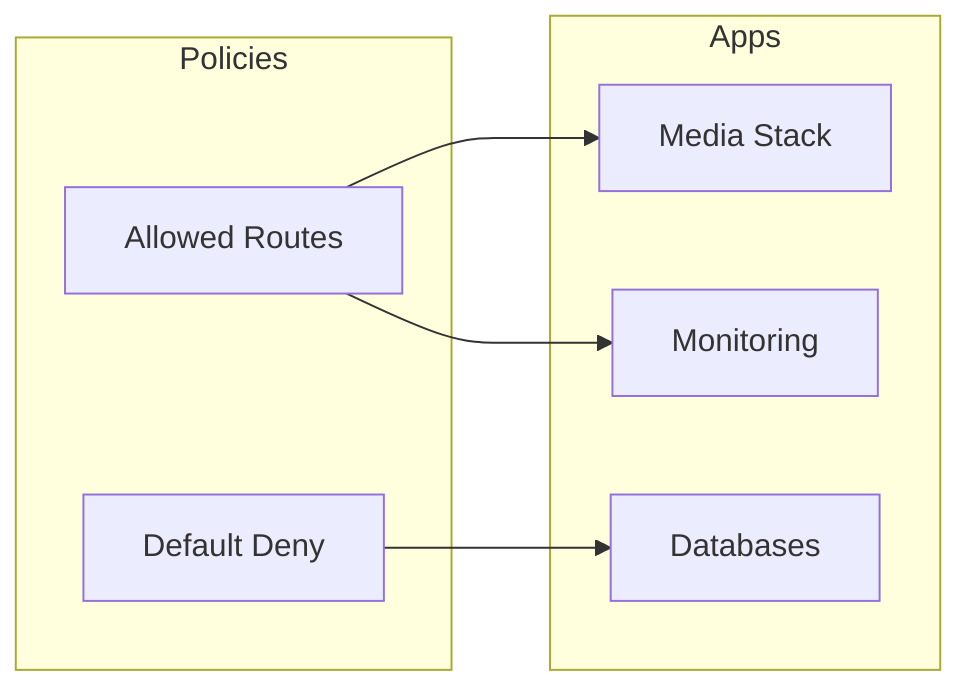
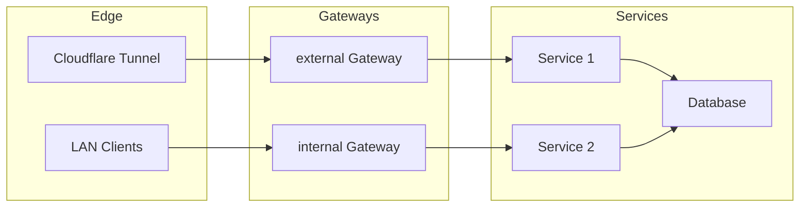

# Network Architecture

This document covers the Kubernetes application-level networking. For physical network topology and VLAN configuration, see [Network Topology](network-topology.md).

## Container Networking (CNI)

### Cilium CNI

The cluster uses **Cilium** as the primary Container Network Interface (CNI):

- **Pod CIDR**: 10.69.0.0/16 (native routing mode)
- **Service CIDR**: 10.96.0.0/16
- **Mode**: Non-exclusive (paired with Multus for multi-network support)
- **Kube-Proxy Replacement**: Enabled (eBPF-based service load balancing)
- **Load Balancing Algorithm**: Maglev with DSR (Direct Server Return)
- **Network Policy**: Endpoint routes enabled
- **BPF Masquerading**: Enabled for outbound traffic

**Key Features**:

- High-performance eBPF data plane
- Native Kubernetes network policy support
- L2 announcements for external load balancer IPs
- Advanced observability and monitoring

### Multus CNI (Multiple Networks)

**Multus** provides additional network interfaces to pods beyond the primary Cilium network:

- **Primary Use**: IoT network attachment (VLAN-based isolation)
- **Network Attachment**: macvlan on ens19 interface
- **Mode**: Bridge mode with DHCP IPAM
- **Purpose**: Enable pods to connect to additional networks (e.g., IoT devices, legacy systems)

Pods can request additional networks via annotations:

```yaml
metadata:
  annotations:
    k8s.v1.cni.cncf.io/networks: macvlan-conf
```

## Gateway API (Envoy Gateway)

The cluster routes all HTTP(S) traffic through **Envoy Gateway** (Gateway API), not Ingress objects. A single `GatewayClass` named `envoy` backs three `Gateway` resources, each with its own Cilium LB-IPAM load-balancer IP:

| Gateway    | IP          | Purpose                                                        |
| ---------- | ----------- | -------------------------------------------------------------- |
| `internal` | 10.100.0.20 | Private services, resolved by k8s-gateway                      |
| `external` | 10.100.0.22 | Public services, reached via Cloudflare Tunnel                 |
| `media`    | 10.100.0.31 | WAN-direct media services (Plex/Jellyfin), bypasses the tunnel |

Each Gateway terminates TLS using wildcard certificates (cert-manager) and exposes per-domain HTTPS listeners for the cluster's domains. Applications attach to a Gateway by creating an `HTTPRoute` whose hostname matches a listener — the listener is auto-selected by hostname, so routes generally don't pin a `sectionName`. Plain HTTP (port 80) listeners redirect to HTTPS.

**Authentication**: Login protection is applied declaratively at the Gateway via Authentik. Apps annotated for forward-auth get a Kyverno-generated `SecurityPolicy` (ext-auth to the Authentik outpost); some apps use native Authentik OIDC instead. See the `authentik-auth` repo skill.

## Load Balancer IP Management

### Cilium L2 Announcements

Cilium's L2 announcement feature provides load balancer IPs for services:

- **How it works**: Cilium announces load balancer IPs via L2 (ARP/NDP)
- **Policy-based**: L2AnnouncementPolicy defines which services get announced
- **Benefits**:
  - No external load balancer required
  - Native Kubernetes LoadBalancer service type support
  - High availability through leader election
  - Automatic failover

**Configuration**: See `kubernetes/apps/kube-system/cilium/config/l2.yaml`

This is how each Envoy Gateway (and any other LoadBalancer service) receives an external IP accessible from the broader network.

### Network Policies


```mermaid
graph LR
    subgraph Policies
        Default[Default Deny]
        Allow[Allowed Routes]
    end

    subgraph Apps
        Media[Media Stack]
        Monitor[Monitoring]
        DB[Databases]
    end

    Allow --> Media
    Allow --> Monitor
    Default --> DB
```

## DNS Configuration

### Internal DNS (k8s-gateway)

- **Purpose**: Authoritative DNS for the cluster's private domains
- **Answers**: Hostnames resolve to the `internal` Envoy Gateway LB IP (10.100.0.20)
- **Delegation**: The OPNsense resolver forwards the private domains to k8s-gateway

### External DNS (Cloudflare)

- **Provider**: Cloudflare (single ExternalDNS instance)
- **Source**: Watches `HTTPRoute`/`Gateway` resources on the public domains
- **Purpose**: Publishes public DNS records; external traffic enters via the Cloudflare Tunnel (cloudflared)

### How DNS Works

1. Create an `HTTPRoute` attached to the `internal`, `external`, or `media` Gateway
2. Internal hostnames are answered by k8s-gateway; public hostnames are synced to Cloudflare by ExternalDNS
3. Services become reachable at their configured hostnames

## Security

### Network Policies

```yaml
apiVersion: networking.k8s.io/v1
kind: NetworkPolicy
metadata:
  name: default-deny
spec:
  podSelector: {}
  policyTypes:
    - Ingress
    - Egress
```

### TLS Configuration

- Automatic certificate management via cert-manager
- Let's Encrypt integration (wildcard certs per domain)
- TLS terminated at the Envoy Gateways

## Traffic Flow


```mermaid
graph LR
    subgraph Edge
        CF[Cloudflare Tunnel]
        LAN[LAN Clients]
    end

    subgraph Gateways
        EXT[external Gateway]
        INT[internal Gateway]
    end

    subgraph Services
        App1[Service 1]
        App2[Service 2]
        DB[Database]
    end

    CF --> EXT
    LAN --> INT
    EXT --> App1
    INT --> App2
    App1 --> DB
    App2 --> DB
```

External clients reach public services through the Cloudflare Tunnel into the `external` Gateway; LAN clients resolve private hostnames via k8s-gateway and hit the `internal` Gateway directly.

## Best Practices

1. **Security**
   - Implement default deny policies
   - Use TLS everywhere
   - Regular security audits
   - Network segmentation

2. **Performance**
   - Load balancer optimization
   - Connection pooling
   - Proper resource allocation
   - Traffic monitoring

3. **Reliability**
   - High availability configuration
   - Failover planning
   - Backup routes
   - Health checks

4. **Monitoring**
   - Network metrics collection
   - Traffic analysis
   - Latency monitoring
   - Bandwidth usage tracking

## Troubleshooting

Common network issues and resolution steps:

1. **Connectivity Issues**
   - Check network policies
   - Verify DNS resolution
   - Inspect service endpoints
   - Review ingress configuration

2. **Performance Problems**
   - Monitor network metrics
   - Check for bottlenecks
   - Analyze traffic patterns
   - Review resource allocation
