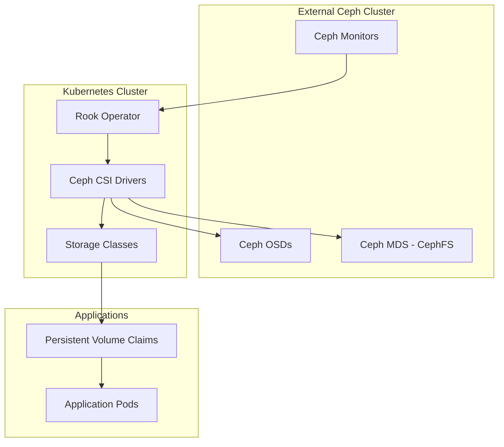

# Storage Architecture

## Storage Overview

The Dapper Cluster uses Rook Ceph as its primary storage solution, providing unified storage for all Kubernetes workloads. The external Ceph cluster runs on Proxmox hosts and is connected to the Kubernetes cluster via Rook's external cluster mode.



## Storage Architecture Decision

### Why Rook Ceph?

The cluster migrated from OpenEBS Mayastor and various NFS backends to Rook Ceph for several key reasons:

1. **Unified Storage Platform**: Single storage solution for all workload types
2. **External Cluster Design**: Leverages existing Proxmox Ceph cluster infrastructure
3. **High Performance**: Direct Ceph integration without NFS overhead
4. **Scalability**: Native Ceph scalability for growing storage needs
5. **Feature Rich**: Snapshots, cloning, expansion, and advanced storage features
6. **ReadWriteMany Support**: CephFS provides shared filesystem access
7. **Production Proven**: Mature, widely-adopted storage solution

### Migration History

- **Previous**: OpenEBS Mayastor (block storage) + Multiple NFS backends (shared storage)
- **Current**: Rook Ceph with CephFS (unified storage)
- **Future**: RBD storage classes for optimized block storage (Phase 2)

## Current Storage Classes

### CephFS Shared Storage (Default)

**Storage Class**: `cephfs-shared`

Primary storage class for all workloads requiring dynamic provisioning.

```yaml
apiVersion: storage.k8s.io/v1
kind: StorageClass
metadata:
  name: cephfs-shared
  annotations:
    storageclass.kubernetes.io/is-default-class: "true"
provisioner: rook-ceph.cephfs.csi.ceph.com
parameters:
  clusterID: rook-ceph
  fsName: cephfs
  pool: cephfs_data
allowVolumeExpansion: true
reclaimPolicy: Delete
volumeBindingMode: Immediate
```

**Characteristics**:
- **Access Mode**: ReadWriteMany (RWX) - Multiple pods can read/write simultaneously
- **Use Cases**:
  - Applications requiring shared storage
  - Media applications
  - Backup repositories (VolSync)
  - Configuration storage
  - General application storage
- **Performance**: Good performance for most workloads, shared filesystem overhead
- **Default**: Yes - all PVCs without explicit storageClassName use this

### CephFS Static Storage

**Storage Class**: `cephfs-static`

Used for pre-existing CephFS paths that need to be mounted into Kubernetes.

**Characteristics**:
- **Access Mode**: ReadWriteMany (RWX)
- **Use Cases**:
  - Mounting existing data directories (e.g., `/truenas/*` paths)
  - Large media libraries
  - Shared configuration repositories
  - Data migration scenarios
- **Provisioning**: Manual - requires creating both PV and PVC
- **Pattern**: See "Static PV Pattern" section below

**Example**: Media storage at `/truenas/media`
```yaml
apiVersion: v1
kind: PersistentVolume
metadata:
  name: media-cephfs-pv
spec:
  capacity:
    storage: 100Ti
  accessModes:
    - ReadWriteMany
  persistentVolumeReclaimPolicy: Retain
  storageClassName: cephfs-static
  csi:
    driver: rook-ceph.cephfs.csi.ceph.com
    nodeStageSecretRef:
      name: rook-csi-cephfs-static
      namespace: rook-ceph
    volumeAttributes:
      clusterID: rook-ceph
      fsName: cephfs
      staticVolume: "true"
      rootPath: /truenas/media
```

### Legacy NFS Storage

**Storage Class**: `used-nfs` (no storage class for static tower/tower-2 PVs)

Legacy NFS storage for remaining Unraid server mounts.

**Servers**:
- `tower.manor` - Primary Unraid server (100Ti NFS)
- `tower-2.manor` - Secondary Unraid server (100Ti NFS)

**Current Usage**:
- Media applications use hybrid approach (CephFS + tower + tower-2)
- SABnzbd downloads to all three storage backends
- Plex reads media from all three backends
- Active in gradual migration to CephFS

**Status**: Legacy - hybrid approach during transition
**Future**: Complete migration to CephFS when Unraid servers are decommissioned

## Storage Provisioning Patterns

### Dynamic Provisioning (Default)

For most applications, simply create a PVC and Kubernetes will automatically provision storage:

```yaml
apiVersion: v1
kind: PersistentVolumeClaim
metadata:
  name: my-app-data
  namespace: my-namespace
spec:
  accessModes:
    - ReadWriteMany
  resources:
    requests:
      storage: 10Gi
  # No storageClassName specified = uses default (cephfs-shared)
```

### Static PV Pattern

For mounting pre-existing CephFS paths:

**Step 1**: Create PersistentVolume
```yaml
apiVersion: v1
kind: PersistentVolume
metadata:
  name: my-static-pv
spec:
  capacity:
    storage: 5Ti
  accessModes:
    - ReadWriteMany
  persistentVolumeReclaimPolicy: Retain
  storageClassName: cephfs-static
  csi:
    driver: rook-ceph.cephfs.csi.ceph.com
    nodeStageSecretRef:
      name: rook-csi-cephfs-static
      namespace: rook-ceph
    volumeAttributes:
      clusterID: rook-ceph
      fsName: cephfs
      staticVolume: "true"
      rootPath: /truenas/my-data  # Pre-existing path in CephFS
```

**Step 2**: Create matching PersistentVolumeClaim
```yaml
apiVersion: v1
kind: PersistentVolumeClaim
metadata:
  name: my-static-pvc
  namespace: my-namespace
spec:
  accessModes:
    - ReadWriteMany
  resources:
    requests:
      storage: 5Ti
  storageClassName: cephfs-static
  volumeName: my-static-pv
```

**Current Static PVs in Use**:
- `media-cephfs-pv` → `/truenas/media` (100Ti)
- `minio-cephfs-pv` → `/truenas/minio` (10Ti)
- `paperless-cephfs-pv` → `/truenas/paperless` (5Ti)

## Storage Decision Matrix

| Workload Type | Storage Class | Access Mode | Rationale |
|---------------|---------------|-------------|-----------|
| Databases | `cephfs-shared` | RWO | Dynamic provisioning, good performance |
| Media Libraries | `cephfs-static` + NFS | RWX | Hybrid: CephFS + Unraid (tower/tower-2) during migration |
| Media Downloads | Multiple backends | RWX | SABnzbd uses CephFS + tower + tower-2 |
| Application Data | `cephfs-shared` | RWO/RWX | Default choice, flexible access |
| Backup Repositories | `cephfs-shared` | RWX | VolSync requires RWX |
| Shared Config | `cephfs-shared` | RWX | Multiple pods need access |
| Bulk Storage | `cephfs-static` | RWX | Large pre-existing directories |

## Backup Strategy

### VolSync with CephFS

All persistent data is backed up using VolSync, which now uses CephFS for its repository storage:

- **Backup Frequency**: Hourly snapshots via ReplicationSource
- **Repository Storage**: CephFS PVC (migrated from NFS)
- **Backend**: Restic repositories on CephFS
- **Retention**: Configurable per-application
- **Recovery**: Supports restore to same or different PVC

**VolSync Repository Location**: `/repository/{APP}` on CephFS

## Network Configuration

### Ceph Networks

The external Ceph cluster uses two networks:

- **Public Network**: 10.150.0.0/24
  - Client connections from Kubernetes
  - Ceph monitor communication
  - Used by CSI drivers
- **Cluster Network**: 10.200.0.0/24
  - OSD-to-OSD replication
  - Not directly accessed by Kubernetes

### Connection Method

Kubernetes connects to Ceph via:
1. **Rook Operator**: Manages connection to external cluster
2. **CSI Drivers**: cephfs.csi.ceph.com for CephFS volumes
3. **Mon Endpoints**: ConfigMap with Ceph monitor addresses
4. **Authentication**: Ceph client.kubernetes credentials

## Performance Characteristics

### CephFS Performance

- **Sequential Read**: Excellent (limited by network, ~10 Gbps)
- **Sequential Write**: Very Good (COW overhead, CRUSH rebalancing)
- **Random I/O**: Good (shared filesystem overhead)
- **Concurrent Access**: Excellent (native RWX support)
- **Metadata Operations**: Good (dedicated MDS servers)

### Optimization Tips

1. **Use RWO when possible**: Even on CephFS, specify RWO if no sharing needed
2. **Size appropriately**: CephFS handles small and large files well
3. **Monitor MDS health**: CephFS performance depends on MDS responsiveness
4. **Enable client caching**: Default CSI settings enable attribute caching

## Storage Operations

### Common Operations

**Expand a PVC**:
```bash
kubectl patch pvc my-pvc -p '{"spec":{"resources":{"requests":{"storage":"20Gi"}}}}'
```

**Check storage usage**:
```bash
kubectl get pvc -A
kubectl exec -it <pod> -- df -h
```

**Monitor Ceph cluster health**:
```bash
kubectl -n rook-ceph get cephcluster
kubectl -n rook-ceph exec -it deploy/rook-ceph-tools -- ceph status
```

**List CephFS mounts**:
```bash
kubectl -n rook-ceph exec -it deploy/rook-ceph-tools -- ceph fs status
```

### Troubleshooting

**PVC stuck in Pending**:
```bash
kubectl describe pvc <pvc-name>
kubectl -n rook-ceph logs -l app=rook-ceph-operator
```

**Slow performance**:
```bash
# Check Ceph cluster health
kubectl -n rook-ceph exec -it deploy/rook-ceph-tools -- ceph health detail

# Check MDS status
kubectl -n rook-ceph exec -it deploy/rook-ceph-tools -- ceph fs status

# Check OSD performance
kubectl -n rook-ceph exec -it deploy/rook-ceph-tools -- ceph osd perf
```

**Mount issues**:
```bash
# Check CSI driver logs
kubectl -n rook-ceph logs -l app=csi-cephfsplugin

# Verify connection to monitors
kubectl -n rook-ceph get configmap rook-ceph-mon-endpoints -o yaml
```

## Future Roadmap (Phase 2)

### Planned: RBD Storage Classes

After completing the Mayastor hardware migration, RBD block storage will be added:

**Planned Storage Classes**:
1. `ceph-ssd-critical` - SSD pool for databases, etcd, critical apps
2. `ceph-rbd` - General purpose block storage
3. `ceph-bulk` - Erasure-coded pool for media and bulk storage

**Benefits**:
- Better performance for block storage workloads
- More efficient use of storage (thin provisioning)
- Snapshot and clone capabilities
- Per-workload storage optimization

**Current Status**: RBD driver disabled, storage classes commented out in manifests

## Best Practices

### Storage Selection

1. **Default to cephfs-shared**: Unless you have specific requirements
2. **Use static PVs for existing data**: Don't duplicate large datasets
3. **Specify requests accurately**: Helps with capacity planning
4. **Use appropriate access modes**: RWO when sharing not needed

### Capacity Planning

1. **Monitor Ceph cluster capacity**:
   ```bash
   kubectl -n rook-ceph exec -it deploy/rook-ceph-tools -- ceph df
   ```
2. **Set appropriate PVC sizes**: CephFS supports expansion
3. **Plan for growth**: Ceph cluster can scale by adding OSDs
4. **Regular capacity reviews**: Check usage trends

### Data Protection

1. **Enable VolSync**: For all stateful applications
2. **Test restores regularly**: Ensure backup viability
3. **Monitor backup success**: Check ReplicationSource status
4. **Retain snapshots appropriately**: Balance storage cost vs recovery needs

### Security

1. **Use namespace isolation**: PVCs are namespace-scoped
2. **Limit access with RBAC**: Control who can create PVCs
3. **Monitor access patterns**: Unusual I/O may indicate issues
4. **Rotate Ceph credentials**: Periodically update client keys

## Monitoring and Observability

### Key Metrics

Monitor these metrics via Prometheus/Grafana:

- Ceph cluster health status
- OSD utilization and performance
- MDS cache hit rates
- PVC capacity usage
- CSI operation latencies
- VolSync backup success rates

### Alerts

Critical alerts configured:

- Ceph cluster health warnings
- High OSD utilization (>80%)
- MDS performance degradation
- PVC approaching capacity
- VolSync backup failures

## References

- **Rook Documentation**: [rook.io/docs](https://rook.io/docs/rook/latest/)
- **Ceph Documentation**: [docs.ceph.com](https://docs.ceph.com/)
- **Local Setup**: `kubernetes/apps/rook-ceph/README.md`
- **Storage Classes**: `kubernetes/apps/rook-ceph/rook-ceph-cluster/app/storageclasses.yaml`
