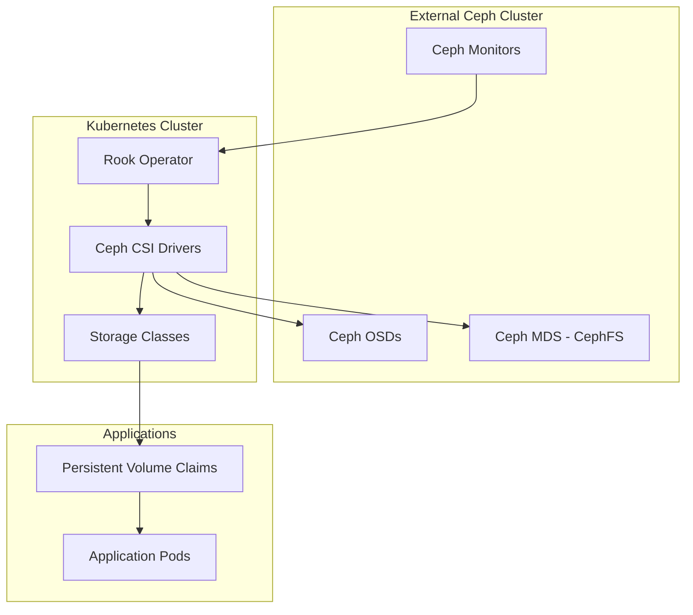

# Storage Architecture

## Storage Overview

The Dapper Cluster uses Rook Ceph as its only storage solution, providing unified block and shared-filesystem storage for all Kubernetes workloads. The external Ceph cluster (Ceph 18.2.x Reef) runs on the Proxmox hosts and is connected to Kubernetes via Rook's external cluster mode. CephFS uses three data pools: `cephfs_data`, `cephfs_media`, and `cephfs_backups`.


```mermaid
graph TD
    subgraph External Ceph Cluster
        MON[Ceph Monitors]
        OSD[Ceph OSDs]
        MDS[Ceph MDS - CephFS]
    end

    subgraph Kubernetes Cluster
        ROOK[Rook Operator]
        CSI[Ceph CSI Drivers]
        SC[Storage Classes]
    end

    subgraph Applications
        APPS[Application Pods]
        PVC[Persistent Volume Claims]
    end

    MON --> ROOK
    ROOK --> CSI
    CSI --> SC
    SC --> PVC
    PVC --> APPS
    CSI --> MDS
    CSI --> OSD
```

## Storage Architecture Decision

### Why Rook Ceph?

The cluster uses Rook Ceph (external mode) for several key reasons:

1. **Unified Storage Platform**: Single storage solution for all workload types
2. **External Cluster Design**: Leverages the Proxmox Ceph cluster infrastructure
3. **High Performance**: Direct Ceph integration over the dedicated 40Gb storage network
4. **Scalability**: Native Ceph scalability for growing storage needs
5. **Feature Rich**: Snapshots, cloning, expansion, and advanced storage features
6. **ReadWriteMany Support**: CephFS provides shared filesystem access
7. **Production Proven**: Mature, widely-adopted storage solution

## Current Storage Classes

The live storage classes are: `ceph-rbd` (default), `cephfs-shared`, `cephfs-static`, and `cephfs-backups`.

### RBD Block Storage (Default)

**Storage Class**: `ceph-rbd`

The default storage class. Any PVC without an explicit `storageClassName` is provisioned as an RBD block volume.

```yaml
apiVersion: storage.k8s.io/v1
kind: StorageClass
metadata:
  name: ceph-rbd
  annotations:
    storageclass.kubernetes.io/is-default-class: "true"
provisioner: rook-ceph.rbd.csi.ceph.com
parameters:
  clusterID: rook-ceph
  pool: rook-pvc-pool
  imageFeatures: layering
  csi.storage.k8s.io/fstype: ext4
allowVolumeExpansion: true
reclaimPolicy: Delete
volumeBindingMode: Immediate
```

**Characteristics**:

- **Access Mode**: ReadWriteOnce (RWO) - single-pod exclusive access
- **Use Cases**: Databases, etcd, and any single-pod app needing high IOPS
- **Performance**: Superior to CephFS for block workloads
- **Default**: Yes

### CephFS Shared Storage

**Storage Class**: `cephfs-shared`

Dynamically-provisioned shared filesystem for workloads needing RWX.

```yaml
apiVersion: storage.k8s.io/v1
kind: StorageClass
metadata:
  name: cephfs-shared
provisioner: rook-ceph.cephfs.csi.ceph.com
parameters:
  clusterID: rook-ceph
  fsName: cephfs
  pool: cephfs_data
  subvolumeGroup: csi
  mounter: kernel
allowVolumeExpansion: true
reclaimPolicy: Delete
volumeBindingMode: Immediate
```

**Characteristics**:

- **Access Mode**: ReadWriteMany (RWX) - Multiple pods can read/write simultaneously
- **Use Cases**:
  - Applications requiring shared storage
  - Configuration storage
  - General multi-pod application storage
- **Performance**: Good performance for most workloads, shared filesystem overhead

### CephFS Static Storage

**Storage Class**: `cephfs-static`

Used for pre-existing CephFS paths that need to be mounted into Kubernetes.

**Characteristics**:

- **Access Mode**: ReadWriteMany (RWX)
- **Use Cases**:
  - Mounting existing CephFS directories (e.g., `/media`)
  - Large media libraries
  - Shared configuration repositories
- **Provisioning**: Manual - requires creating both PV and PVC
- **Pattern**: See "Static PV Pattern" section below

**Example**: Media storage at `/media` on cephfs_media pool

```yaml
apiVersion: v1
kind: PersistentVolume
metadata:
  name: media-cephfs-pv
spec:
  capacity:
    storage: 100Ti
  accessModes:
    - ReadWriteMany
  persistentVolumeReclaimPolicy: Retain
  storageClassName: cephfs-static
  csi:
    driver: rook-ceph.cephfs.csi.ceph.com
    nodeStageSecretRef:
      name: rook-csi-cephfs-static
      namespace: rook-ceph
    volumeAttributes:
      clusterID: rook-ceph
      fsName: cephfs
      staticVolume: "true"
      rootPath: /media
      pool: cephfs_media
      mounter: kernel
```

### CephFS Backups

**Storage Class**: `cephfs-backups`

Dedicated CephFS class on the `cephfs_backups` pool with a `Retain` reclaim policy, used for backup repositories so data survives PVC deletion.

**Characteristics**:

- **Access Mode**: ReadWriteMany (RWX)
- **Reclaim Policy**: Retain
- **Use Cases**: VolSync Restic repositories and other backup data

## Storage Provisioning Patterns

### Dynamic Provisioning (Default)

For most applications, simply create a PVC and Kubernetes will automatically provision storage. With no `storageClassName`, the default `ceph-rbd` (RWO block) class is used; set `storageClassName: cephfs-shared` when you need RWX:

```yaml
apiVersion: v1
kind: PersistentVolumeClaim
metadata:
  name: my-app-data
  namespace: my-namespace
spec:
  accessModes:
    - ReadWriteOnce
  resources:
    requests:
      storage: 10Gi
  # No storageClassName specified = uses default (ceph-rbd, RWO)
```

### Static PV Pattern

For mounting pre-existing CephFS paths:

**Step 1**: Create PersistentVolume

```yaml
apiVersion: v1
kind: PersistentVolume
metadata:
  name: my-static-pv
spec:
  capacity:
    storage: 5Ti
  accessModes:
    - ReadWriteMany
  persistentVolumeReclaimPolicy: Retain
  storageClassName: cephfs-static
  csi:
    driver: rook-ceph.cephfs.csi.ceph.com
    nodeStageSecretRef:
      name: rook-csi-cephfs-static
      namespace: rook-ceph
    volumeAttributes:
      clusterID: rook-ceph
      fsName: cephfs
      staticVolume: "true"
      rootPath: /my-data # Path in CephFS
      pool: cephfs_data # Target data pool
      mounter: kernel # Kernel mounter for better performance
```

**Step 2**: Create matching PersistentVolumeClaim

```yaml
apiVersion: v1
kind: PersistentVolumeClaim
metadata:
  name: my-static-pvc
  namespace: my-namespace
spec:
  accessModes:
    - ReadWriteMany
  resources:
    requests:
      storage: 5Ti
  storageClassName: cephfs-static
  volumeName: my-static-pv
```

**Current Static PVs in Use**:

- `media-cephfs-pv` → `/media` on cephfs_media pool (100Ti)
- `minio-cephfs-pv` → `/minio` on cephfs_data pool (10Ti)
- `paperless-cephfs-pv` → `/paperless` on cephfs_data pool (5Ti)

## Storage Decision Matrix

| Workload Type                 | Storage Class                      | Access Mode | Rationale                                    |
| ----------------------------- | ---------------------------------- | ----------- | -------------------------------------------- |
| Databases (PostgreSQL, etc.)  | `ceph-rbd`                         | RWO         | Best performance for block storage workloads |
| Media Libraries               | `cephfs-static` or `cephfs-shared` | RWX         | Shared access for media servers              |
| Media Downloads               | `cephfs-shared`                    | RWX         | Multi-pod write access                       |
| Application Data (single pod) | `ceph-rbd`                         | RWO         | High performance block storage               |
| Application Data (multi-pod)  | `cephfs-shared`                    | RWX         | Concurrent access required                   |
| Backup Repositories           | `cephfs-backups`                   | RWX         | Retain policy, dedicated pool                |
| Shared Config                 | `cephfs-shared`                    | RWX         | Multiple pods need access                    |
| Large media libraries         | `cephfs-static`                    | RWX         | Pre-existing CephFS paths                    |

## Backup Strategy

### VolSync

All persistent data is backed up using VolSync:

- **Backup Frequency**: Hourly snapshots via ReplicationSource
- **Repository Storage**: CephFS (`cephfs-backups` pool), Restic repositories
- **Restore/cache PVCs**: Default to `ceph-rbd`
- **Retention**: Configurable per-application
- **Recovery**: Supports restore to same or different PVC

**VolSync Repository Location**: `/repository/{APP}` on CephFS

## Network Configuration

### Ceph Networks

The external Ceph cluster uses two networks:

- **Public Network**: 10.150.0.0/24
  - Client connections from Kubernetes
  - Ceph monitor communication
  - Used by CSI drivers
- **Cluster Network**: 10.200.0.0/24
  - OSD-to-OSD replication
  - Not directly accessed by Kubernetes

### Connection Method

Kubernetes connects to Ceph via:

1. **Rook Operator**: Manages connection to external cluster
2. **CSI Drivers**: cephfs.csi.ceph.com for CephFS volumes
3. **Mon Endpoints**: ConfigMap with Ceph monitor addresses
4. **Authentication**: Ceph client.kubernetes credentials

## Performance Characteristics

### CephFS Performance

- **Sequential Read**: Excellent (limited by network, ~10 Gbps)
- **Sequential Write**: Very Good (COW overhead, CRUSH rebalancing)
- **Random I/O**: Good (shared filesystem overhead)
- **Concurrent Access**: Excellent (native RWX support)
- **Metadata Operations**: Good (dedicated MDS servers)

### Optimization Tips

1. **Use RWO when possible**: Even on CephFS, specify RWO if no sharing needed
2. **Size appropriately**: CephFS handles small and large files well
3. **Monitor MDS health**: CephFS performance depends on MDS responsiveness
4. **Enable client caching**: Default CSI settings enable attribute caching

## Storage Operations

### Common Operations

**Expand a PVC**:

```bash
kubectl patch pvc my-pvc -p '{"spec":{"resources":{"requests":{"storage":"20Gi"}}}}'
```

**Check storage usage**:

```bash
kubectl get pvc -A
kubectl exec -it <pod> -- df -h
```

**Monitor Ceph cluster health**:

```bash
kubectl -n rook-ceph get cephcluster
kubectl -n rook-ceph exec -it deploy/rook-ceph-tools -- ceph status
```

**List CephFS mounts**:

```bash
kubectl -n rook-ceph exec -it deploy/rook-ceph-tools -- ceph fs status
```

### Troubleshooting

**PVC stuck in Pending**:

```bash
kubectl describe pvc <pvc-name>
kubectl -n rook-ceph logs -l app=rook-ceph-operator
```

**Slow performance**:

```bash
# Check Ceph cluster health
kubectl -n rook-ceph exec -it deploy/rook-ceph-tools -- ceph health detail

# Check MDS status
kubectl -n rook-ceph exec -it deploy/rook-ceph-tools -- ceph fs status

# Check OSD performance
kubectl -n rook-ceph exec -it deploy/rook-ceph-tools -- ceph osd perf
```

**Mount issues**:

```bash
# Check CSI driver logs
kubectl -n rook-ceph logs -l app=csi-cephfsplugin

# Verify connection to monitors
kubectl -n rook-ceph get configmap rook-ceph-mon-endpoints -o yaml
```

## Best Practices

### Storage Selection

1. **Databases and single-pod apps**: Use `ceph-rbd` for best performance
2. **Shared storage needs**: Use `cephfs-shared` for RWX access
3. **Use static PVs for existing data**: Don't duplicate large datasets
4. **Specify requests accurately**: Helps with capacity planning
5. **Choose appropriate access modes**: RWO for RBD, RWX for CephFS

### Capacity Planning

1. **Monitor Ceph cluster capacity**:
   ```bash
   kubectl -n rook-ceph exec -it deploy/rook-ceph-tools -- ceph df
   ```
2. **Set appropriate PVC sizes**: CephFS supports expansion
3. **Plan for growth**: Ceph cluster can scale by adding OSDs
4. **Regular capacity reviews**: Check usage trends

### Data Protection

1. **Enable VolSync**: For all stateful applications
2. **Test restores regularly**: Ensure backup viability
3. **Monitor backup success**: Check ReplicationSource status
4. **Retain snapshots appropriately**: Balance storage cost vs recovery needs

### Security

1. **Use namespace isolation**: PVCs are namespace-scoped
2. **Limit access with RBAC**: Control who can create PVCs
3. **Monitor access patterns**: Unusual I/O may indicate issues
4. **Rotate Ceph credentials**: Periodically update client keys

## Monitoring and Observability

### Key Metrics

Monitor these metrics via Prometheus/Grafana:

- Ceph cluster health status
- OSD utilization and performance
- MDS cache hit rates
- PVC capacity usage
- CSI operation latencies
- VolSync backup success rates

### Alerts

Critical alerts configured:

- Ceph cluster health warnings
- High OSD utilization (>80%)
- MDS performance degradation
- PVC approaching capacity
- VolSync backup failures

## References

- **Rook Documentation**: [rook.io/docs](https://rook.io/docs/rook/latest/)
- **Ceph Documentation**: [docs.ceph.com](https://docs.ceph.com/)
- **Local Setup**: `kubernetes/apps/rook-ceph/README.md`
- **Storage Classes**: `kubernetes/apps/rook-ceph/rook-ceph-cluster/app/storageclasses.yaml`
