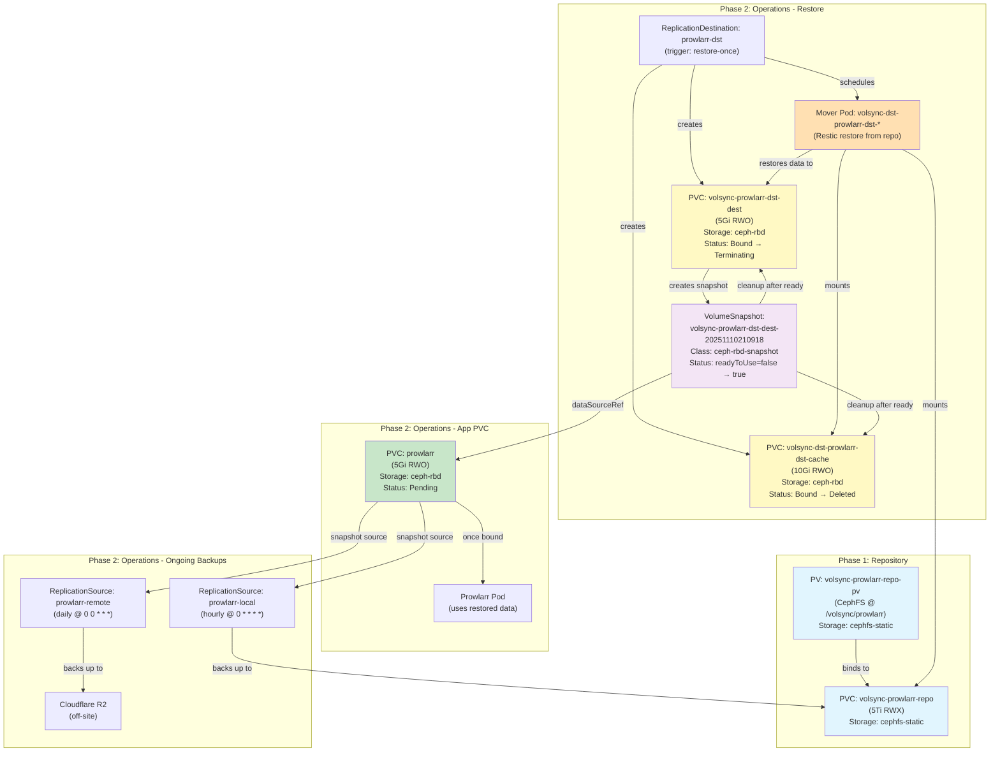

# VolSync Architecture

This document illustrates the PVC and snapshot lifecycle for VolSync two-phase backups.

## Component Flow

## Lifecycle Phases

### Phase 1: Repository Setup
1. **PV Created**: Static CephFS PV points to `/volsync/${APP}` on cephfs_backups pool
2. **PVC Binds**: Repository PVC binds to PV using `cephfs-static` storage class

### Phase 2: One-Time Restore (on first deployment)
1. **ReplicationDestination Created**: With `trigger: restore-once`
2. **Temporary PVCs Created**:
   - Cache PVC (10Gi, for Restic cache)
   - Dest PVC (matches app size, receives restored data)
3. **Mover Pod Runs**: Mounts repo + cache + dest, runs Restic restore
4. **Snapshot Created**: VolumeSnapshot taken from dest PVC
5. **Cleanup**: Cache and dest PVCs deleted after snapshot ready

### Phase 2: App PVC Provisioning
1. **App PVC Created**: References snapshot via `dataSourceRef`
2. **CSI Provisions**: Creates new PV from snapshot data
3. **App Pod Starts**: Mounts PVC with restored data

### Phase 2: Ongoing Backups
1. **Local ReplicationSource**: Hourly snapshots → CephFS repo (24h + 7d retention)
2. **Remote ReplicationSource**: Daily backups → Cloudflare R2 (7d retention)

## Storage Classes

| Resource | Storage Class | Pool | Type | Access Mode |
|----------|---------------|------|------|-------------|
| Repository | `cephfs-static` | cephfs_backups | CephFS (static) | RWX |
| App PVC | `ceph-rbd` | rook-pvc-pool | RBD | RWO |
| Cache | `ceph-rbd` | rook-pvc-pool | RBD | RWO |
| Dest | `ceph-rbd` | rook-pvc-pool | RBD | RWO |
| Snapshots | `ceph-rbd-snapshot` | - | RBD Snapshot | - |

## Troubleshooting

### Snapshot Stuck at readyToUse: false
- Check if source PVC is terminating: `kubectl get pvc -n <namespace>`
- Check snapshot-controller logs: `kubectl logs -n kube-system -l app=snapshot-controller`
- Verify snapshot content exists: `kubectl get volumesnapshotcontent`

### App PVC Pending
- Verify snapshot is ready: `kubectl get volumesnapshot -n <namespace>`
- Check CSI provisioner logs: `kubectl logs -n rook-ceph -l app=csi-rbdplugin-provisioner -c csi-provisioner`

### Restore Failed
- Check mover pod logs: `kubectl logs -n <namespace> -l volsync.backube/replicationdestination=<app>-dst`
- Verify repository PVC is bound: `kubectl get pvc -n <namespace> volsync-<app>-repo`
